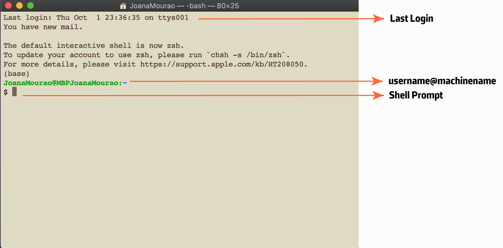

.. _before-begin:

***************
Before we begin
***************

BASH
####

Before you start with the tutorial, you will find here some basic Bash Shell commands that will help you to manage directories and files.

.. note::
   Shell is an interface that accepts commands and delivers them to the operating system to perform.
   UNIX-based operating systems (Linux, macOS, and others) can have different Shell types (e.g., Bash, zsh).

This small intro will focus on Bash Shell. However, if you have the latest MacOS Catalina, zsh will be an alternative to the Bash Shell.

Exploring the Terminal
**********************

First, you need to look for your Terminal, the program that allows you to interact with the Shell.

Open the Terminal as explained below:

* If you're on a Mac, you'll find the Terminal under Applications -> Utilities. The easiest way is to press 'command + space' which will bring up Spotlight, and then you can write Terminal.
* If you're on a Linux then you will probably find it in Applications -> System or Applications -> Utilities.

.. attention::
   Yet, if you have a Windows-based system, you will need to install a Shell and a Terminal.
   First, be sure that you have all the Windows 10 or Windows 11 upgrades performed.
   Second, install the `Windows Subsystem for Linux (WSL) <https://docs.microsoft.com/en-us/windows/wsl/install>`_ following the instructions provided in the URL.
   Finally, reboot your computer and your new Terminal will appear as ``Ubuntu on Windows``.

   If you are working with the WSL, remember that if you want to access the ``Documents`` folder you should write on the command line ``/mnt/c/Users/XXX/Documents`` instead of ``\Users\XXX\Documents``.

   Additionally, if you want to open locally the ``Documents`` folder just write on the command line ``explorer.exe .``

Whenever you open a Terminal, you will see your last login credentials and a Shell prompt.
The appearance might vary a little, but usually, you will see the username@machinename followed by a ``$`` sign.

*Figure 2. This is an example of a macOS Terminal.*

Basic Bash Commands
*******************

Try to run in the Terminal some of the basic Bash commands and look at the output. Below you can see handy comments for users that were added after the hash ``#`` mark and are ignored by Bash.

.. note::
   In most of these examples, you shouldn't forget to write in the command line what is the file or directory that you want to move, remove, create, or copy.

**A. Change Directory (cd) commands**

.. code-block:: bash

   # Navigate between directories on your computer
   # In this case, it will go to Documents directory
   $ cd Documents/

   # Display the current directory
   $ cd .

   # Go back to the directory above
   $ cd ..

   # Go back to the home directory
   $ cd ~

   # Go to the root of the file system
   $ cd /

**B. List (ls) commands**,

.. code-block:: bash

  # Print a list of files and subdirectories within directories
  $ ls

  # Print the contents of a specific directory
  # In this case, it prints the Desktop content
  $ ls Desktop/

  # List all the hidden files in a directory
  $ ls -a

  # Print a more detailed list of files
  $ ls -l

  # Regardless of what directory you are into it will always list your home directory
  $ ls ~

**C. Organizing files and directories**

.. code-block:: bash

    # Create a new directory (mkdir)
    $ mkdir <folder_name1>

    # Used to create empty new files (touch)
    $ touch <filename1> <filename2>

    # Moves one or more files from one directory to another (mv)
    # You need to specify the <source_file> and the <destination> directory
    $ mv <source_file> <destination>

    # Delete a file (rm)
    $ rm <filename1>

    # Delete directories and every file inside it (rm -r)
    $ rm -r <folder_name1>

    # Remove empty directories (rmdir)
    % rmdir <folder_name1>

    # Copy files to another directory (cp)
    # You need to specify the <source_file> to be copied and the <destination> directory
    $ cp <source_file> <destination>

    # Copy a directory and its contents to another directory (cp -r)
    $ cp -r <folder_name1> <folder_name2>

**D. Viewing and exploring file content**

.. code-block:: bash

   # Display the first 10 lines of a created file (head)
   $ head -n 10 <filename1>

   # Display the last 10 lines of a created file (tail)
   $ tail -n 10 <filename1>

   # Concatenate or join two or more files into a single one (cat)
   $ cat <filename1>.txt <filename2>.txt > <filename3_join>.txt

   # Search for patterns in a file (grep)
   # Extract the lines that match the ‘>’ symbol in this case the headers
   $ grep ‘>’ NC_002695.2.fasta

   # Search for a nucleotide sequence and print 1 line before and after any match
   $ grep -B 1 -A 1 'GAGGTTGTTGAAATCGA' NC_002695.2.fasta

   # View content of a created file (less)
   $ less <filename1>
   $ Q # Press Q to exit less

   # Edit content of a created file (nano)
   $ nano <filename1>

**E. Other useful commands**

.. code-block:: bash

   # Clear the terminal screen
   $ clear

   # Print the current working directory
   $ pwd

   # Print how much if the computer working
   $ top

   # Download files from the internet using a link (wget)
   # You need to specify the <link_source> to the file
   $ wget <link_source>

.. seealso::
   You can also use a semicolon ``;`` character to write two commands on the same line.

   If you have a very long command you can run separate code chunks onto separate lines by using the ``\`` character to make it more readable.

Further Reading
***************

This small tutorial is only a little start to basic Bash commands. However, you will see in the future that they will bring you a lot of advantages and benefits.
If you want to dig a little bit more about specific or advanced Bash commands, I leave here some available online resources and books:

* `UNIX Tutorial for Beginners <http://www.ee.surrey.ac.uk/Teaching/Unix/>`_
* `The Linux Command Line <http://linuxcommand.org/tlcl.php>`_
* `Beginner's Guide to the Bash Terminal <https://www.youtube.com/watch?v=oxuRxtrO2Ag>`_
* `bash Cookbook <https://www.amazon.com/bash-Cookbook-Solutions-Examples-Users/dp/1491975334/>`_
* `Learning the bash Shell <https://www.amazon.com/Learning-bash-Shell-Programming-Nutshell-ebook/dp/B0043GXMSY/>`_
* `The Biostar Handbook: 2nd Edition <https://www.biostarhandbook.com/index.html>`_
