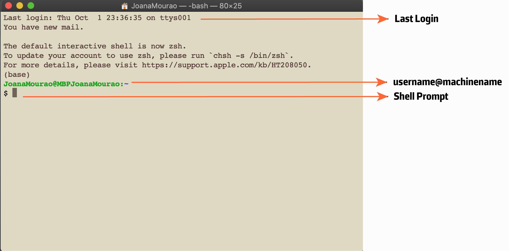

.. _before-begin:

***************
Before we begin
***************

BASH
####

Before you start with the tutorial, you will find here the Bash Shell commands that you will need to manage directories and files, inspect sequence data, and **run the same analysis on several genomes** without typing each command by hand.

.. note::
   Shell is an interface that accepts commands and delivers them to the operating system to perform.
   UNIX-based operating systems (Linux, macOS, and others) can have different Shell types (e.g., Bash, zsh).

This intro focuses on the Bash Shell. However, since macOS Catalina (10.15) the default shell of macOS is **zsh**. The commands of this tutorial were written to work in both shells. The only difference that you may notice is in the error messages (e.g., when a wildcard does not match any file, zsh may print ``no matches found``).

.. note::
   * Lines starting with ``$`` show the **prompt**; you must not type the ``$`` itself.
   * Everything after a hash ``#`` is a comment and is ignored by the shell.
   * Commands that have **several lines** (e.g., loops and scripts) are shown **without the** ``$`` so that you can copy and paste the whole block into the Terminal.
   * Words between ``<`` and ``>`` (e.g., ``<filename>``) are placeholders: replace them (and the ``<>`` symbols) by your own names.

This page has two parts. **Part 1 (Essentials)** teaches the commands that you will use in every section of the tutorial. **Part 2 (Going further)** teaches how to inspect tables and how to repeat a command in many samples, which you will use in the last sections of the tutorial. Do not worry if Part 2 looks hard at the first time; you can come back to it when you need it.

Exploring the Terminal
**********************

First, you need to look for your Terminal, the program that allows you to interact with the Shell.

Open the Terminal as explained below:

* If you're on a Mac, you'll find the Terminal under Applications -> Utilities. The easiest way is to press 'command + space' which will bring up Spotlight, and then you can write Terminal.
* If you're on a Linux then you will probably find it in Applications -> System or Applications -> Utilities.

.. attention::
   Yet, if you have a Windows-based system, you will need to install a Shell and a Terminal.
   First, be sure that you have all the Windows 10 (version 2004 or higher) or Windows 11 upgrades performed.
   Second, open ``PowerShell`` as administrator and run ``wsl --install``, as explained in the `Windows Subsystem for Linux (WSL) <https://learn.microsoft.com/en-us/windows/wsl/install>`_ official page.
   Finally, reboot your computer and your new Terminal will appear as ``Ubuntu``.

   If you are working with the WSL, remember that if you want to access the ``Documents`` folder of Windows you should write on the command line ``/mnt/c/Users/XXX/Documents`` instead of ``\Users\XXX\Documents``. However, for better performance, keep your tutorial files inside the Linux home directory (``~``).

   Additionally, if you want to open locally the current folder just write on the command line ``explorer.exe .``

Whenever you open a Terminal, you will see your last login credentials and a Shell prompt.
The appearance might vary a little, but usually, you will see the username@machinename followed by a ``$`` (bash) or ``%`` (zsh) sign.

*Figure 2. This is an example of a macOS Terminal.*

Part 1. Essentials
******************

Paths: where are my files?
==========================

Every file and directory (folder) has a **path**, the address that tells the shell where it is. Understanding paths is the most important step to avoid the typical error ``No such file or directory``.

.. csv-table:: Types of paths and special symbols
   :header: "Symbol", "Meaning", "Example"
   :widths: 15, 40, 40

   "``/``", "The root of the file system. A path that starts with ``/`` is an **absolute path**: it works from any location", "``/Users/maria/Documents/tutorial`` (macOS), ``/home/maria/tutorial`` (Linux)"
   "``~``", "Your **home directory** (a shortcut for ``/Users/maria`` or ``/home/maria``)", "``~/tutorial`` is the directory ``tutorial`` inside your home"
   "``.``", "The **current** directory (where you are now)", "``./script.sh`` is the file ``script.sh`` in the current directory"
   "``..``", "The directory **above** the current one", "``../raw_data`` is the directory ``raw_data`` next to the current one"
   "no ``/`` at the beginning", "A **relative path**: it starts from the current directory", "``raw_data/strainA_R1.fastq.gz``"

.. hint::
   * Use ``pwd`` to see where you are and ``ls`` to see what is there before running any command.
   * Press the **Tab** key to auto-complete file and directory names. It saves time and avoids typing errors.
   * Press the **up/down arrows** to browse the commands that you have already used, and **Ctrl + C** to stop a running command.
   * Commands are **case-sensitive** (``Tutorial`` and ``tutorial`` are different) and spaces separate the words of a command. Avoid spaces in file names.

Create a practice directory
===========================

To practise, you will create a directory with some small example files (two tiny genomes, a list of samples, a table of resistance genes, and two sequencing reads). Copy and paste the following block into the Terminal. You do not need to understand it now; at the end of this page you will.

.. code-block:: bash

   mkdir -p ~/bash_practice
   cd ~/bash_practice
   printf ">seq1 Escherichia coli plasmid\nATGAAAGGGCCCTTTAAATAG\n>seq2 Salmonella chromosome\nGGGATATCCCGGGATATCCCAT\n>seq3 Escherichia coli chromosome\nATGCGCGCGTATATATTAGCG\n" > genomeA.fasta
   printf ">seq1 Escherichia coli chromosome\nATGGCGGCGTTTAAAGGGTAA\n>seq2 Escherichia coli plasmid\nATGCCCGGGAAATTTCCCTAG\n" > genomeB.fasta
   printf "strainA\nstrainB\n" > samples.txt
   printf "genome\tgene\tidentity\tcoverage\nstrainA\tblaTEM-1\t100.0\t100.0\nstrainA\ttet(A)\t99.5\t100.0\nstrainB\tsul1\t100.0\t98.2\nstrainB\tblaTEM-1\t99.8\t100.0\nstrainB\tdfrA17\t97.0\t100.0\n" > results.tsv
   printf "@read1 sample=strainA\nACGTACGTAC\n+\nIIIIIIIIII\n@read2 sample=strainA\nTTGGCCAATT\n+\nIIIIIIIIII\n" > reads.fastq
   gzip -k reads.fastq
   ls

You should see the list of the files that were created: ``genomeA.fasta``, ``genomeB.fasta``, ``reads.fastq``, ``reads.fastq.gz``, ``results.tsv`` and ``samples.txt``.

.. note::
   From now on, all the examples of this part use the files of ``~/bash_practice``. Make sure that you are inside that directory (``cd ~/bash_practice``) before running the commands.

A. Change Directory (cd) commands
=================================

.. code-block:: bash

   # Display the current directory (print working directory)
   $ pwd

   # Navigate between directories on your computer
   # In this case, it will go to the Documents directory inside your home
   $ cd ~/Documents

   # Go back to the directory above
   $ cd ..

   # Go back to the previous directory where you were
   $ cd -

   # Go back to the home directory
   $ cd ~

   # Go to the practice directory
   $ cd ~/bash_practice

   # Go to the root of the file system
   $ cd /

B. List (ls) commands
=====================

.. code-block:: bash

   # Go to the practice directory
   $ cd ~/bash_practice

   # Print a list of files and subdirectories within the current directory
   $ ls

   # Print the contents of another directory, without moving to it
   $ ls ~/Documents

   # List all the files, including the hidden ones (starting with a dot)
   $ ls -a

   # Print a more detailed list of files (permissions, owner, size in bytes, date, name)
   $ ls -l

   # Print a detailed list with human-readable file sizes (e.g., 5.4M) sorted by size
   $ ls -lhS

   # List only the files with a specific extension (* is a wildcard, see below)
   $ ls *.fasta

C. Organizing files and directories
===================================

.. code-block:: bash

   # Create a new directory (mkdir)
   $ mkdir results

   # Create a directory and all the missing parent directories (mkdir -p)
   $ mkdir -p tutorial/raw_data

   # Create several directories at once using brace expansion
   $ mkdir -p tutorial/{qc,assembly,annotation}

   # Create an empty new file (touch)
   $ touch notes.txt

   # Copy a file to another directory (cp): <source_file> <destination>
   $ cp genomeA.fasta results/

   # Copy a file giving it a new name
   $ cp genomeA.fasta results/genomeA_copy.fasta

   # Copy a directory and its contents (cp -r)
   $ cp -r results results_backup

   # Move a file to another directory (mv)
   $ mv notes.txt results/

   # Rename a file (mv)
   $ mv results/notes.txt results/my_notes.txt

   # Create a shortcut (symbolic link) to a file without duplicating it (ln -s)
   # Useful to avoid copying large files, such as fastq files
   $ ln -s reads.fastq.gz results/reads_link.fastq.gz

   # Find files by name inside a directory and its subdirectories (find)
   $ find ~/bash_practice -name "*.fasta"

   # Delete a file (rm)
   $ rm results/my_notes.txt

   # Delete a directory and every file inside it (rm -r)
   $ rm -r results_backup

   # Remove an empty directory (rmdir)
   $ rmdir tutorial/raw_data

.. warning::
   There is no recycle bin in the shell: **deleted files cannot be recovered!** Check twice what you are removing, never run ``rm -r`` in a directory that you do not know, and use ``rm -i <file>`` to ask for confirmation before deleting.

D. Viewing and exploring file content
=====================================

.. code-block:: bash

   # Display the whole content of a small file (cat)
   $ cat samples.txt

   # Display the first lines of a file (head). By default, 10 lines
   $ head -n 4 genomeA.fasta

   # Display the last lines of a file (tail)
   $ tail -n 2 genomeA.fasta

   # Concatenate or join two or more files into a single one (cat and >, see Part 2)
   $ cat genomeA.fasta genomeB.fasta > genomes_joined.txt

   # Count the number of lines, words and characters of a file (wc)
   $ wc genomeA.fasta
   $ wc -l genomeA.fasta

   # Search for patterns in a file (grep)
   # Extract the lines that contain the '>' symbol, in this case the headers of a fasta file
   $ grep '>' genomeA.fasta

   # Count how many sequences a multi-fasta file has
   $ grep -c '>' genomeA.fasta

   # Search for a nucleotide sequence and print 1 line before and after any match
   $ grep -B 1 -A 1 'GGGATATCCC' genomeA.fasta

   # Search for a word ignoring uppercase/lowercase, and show the line numbers
   $ grep -i -n 'plasmid' genomeA.fasta

   # View the content of a compressed file without uncompressing it (gunzip -c)
   # (zcat also works on Linux, but on macOS you need to use gunzip -c)
   $ gunzip -c reads.fastq.gz | head -n 4

   # View a long file page by page (less)
   # Press the space bar to scroll down, / to search, and q to exit less
   $ less genomes_joined.txt

   # Edit the content of a file with a simple text editor (nano)
   # Press Ctrl + O and Enter to save, and Ctrl + X to exit nano
   $ nano samples.txt

For example, ``grep '>' genomeA.fasta`` should print the three headers of the file:

.. code-block:: text

   >seq1 Escherichia coli plasmid
   >seq2 Salmonella chromosome
   >seq3 Escherichia coli chromosome

E. Wildcards and quotes
=======================

**Wildcards** are special characters that allow you to select many files with only one name. The shell replaces them by the names of the files that match **before** running the command.

.. csv-table:: Most common wildcards
   :header: "Wildcard", "Meaning", "Example"
   :widths: 15, 40, 40

   "``*``", "Any number of characters (including none)", "``ls *.fasta`` lists ``genomeA.fasta`` and ``genomeB.fasta``"
   "``?``", "Exactly one character", "``ls genome?.fasta`` lists the same two files"
   "``[AB]``", "One of the characters inside the brackets", "``ls genome[A].fasta`` lists only ``genomeA.fasta``"
   "``{a,b}``", "List of alternatives (brace expansion)", "``mkdir {qc,assembly}`` creates two directories"

.. code-block:: bash

   $ ls *.fasta
   $ ls genome?.fasta
   $ grep -c '>' *.fasta

   # Try the same command with a wildcard that does not match any file
   $ ls *.xyz

The last command will give an error because there are no files with the extension ``.xyz``.

**Quotes** protect the special characters from the shell:

.. code-block:: bash

   # Single quotes: everything inside is written exactly as it is
   $ echo '*.fasta costs $5'

   # Double quotes: protect spaces and wildcards, but variables (see Part 2) are still replaced
   $ echo "my home is $HOME"

   # Without quotes, the wildcard is replaced by the names of the files
   $ echo *.fasta

.. admonition:: Exercises (Part 1)

   1. Which command shows the directory where you are? Which command lists the files with their sizes in a human-readable format?
   2. How many sequences does ``genomeB.fasta`` have? Which sequences are plasmids?
   3. Create a directory ``backup`` inside ``~/bash_practice`` and copy all the ``.fasta`` files to it using one single command.
   4. Show the last two lines of ``results.tsv``.
   5. How many reads does ``reads.fastq.gz`` have? Remember that each read has 4 lines.
   6. Use ``find`` to list all the ``.fasta`` files that are inside ``~/bash_practice``.

   **Answers:** (1) ``pwd`` and ``ls -lh``; (2) ``grep -c '>' genomeB.fasta`` gives 2, and ``grep plasmid genomeB.fasta`` shows ``seq2``; (3) ``mkdir backup`` and ``cp *.fasta backup/``; (4) ``tail -n 2 results.tsv``; (5) ``gunzip -c reads.fastq.gz | wc -l`` gives 8 lines, so 2 reads; (6) ``find ~/bash_practice -name "*.fasta"``.

Other useful commands
=====================

.. code-block:: bash

   # Clear the terminal screen
   $ clear

   # Print the processes that are using more of the computer resources (press q to exit)
   $ top

   # Print the number of available CPUs (useful to set the number of threads of a tool)
   $ nproc               # Linux/WSL
   $ sysctl -n hw.ncpu   # macOS

   # Print the free disk space and the size of a directory
   $ df -h
   $ du -sh ~/bash_practice

   # Download files from the internet using a link (wget)
   # You need to specify the <link_source> to the file
   $ wget <link_source>

   # Alternatively, you can use curl (installed by default on macOS)
   $ curl -L -O <link_source>

   # Display the manual of a command (press q to exit)
   $ man ls

   # Show where a program is installed
   $ which python

   # Show the history of the commands that you have already used
   $ history

.. seealso::
   You can also use a semicolon ``;`` character to write two commands on the same line, or ``&&`` to run the second command only if the first one finishes successfully.

   If you have a very long command you can run separate code chunks onto separate lines by using the ``\`` character at the end of each line (with nothing after it) to make it more readable.

Part 2. Going further
*********************

.. note::
   The commands of this part are used in the last sections of the tutorial to inspect result tables and to run the same analysis in **several genomes**. You can read them now, but you can also return to this part later, when you need it.

F. Redirection and pipes
========================

Most commands print the results on the screen (the **standard output**). You can save these results in a file or send them directly to another command.

.. code-block:: bash

   $ cd ~/bash_practice

   # Save the output of a command in a new file (>)
   # Warning: if the file already exists it will be overwritten
   $ grep '>' genomeA.fasta > headers.txt
   $ cat headers.txt

   # Add the output to the end of an existing file (>>)
   $ echo "strainC" >> samples.txt
   $ cat samples.txt

   # Use the output of one command as the input of the next one (|), called a pipe
   # This counts the number of reads of a compressed fastq file (4 lines per read)
   $ gunzip -c reads.fastq.gz | wc -l | awk '{print $1/4}'

   # Save the error messages (standard error) in a separate log file (2>)
   $ ls file_that_does_not_exist 2> error.log
   $ cat error.log

   # Save both the output and the error messages in the same file (&>)
   $ ls genomeA.fasta file_that_does_not_exist &> all_messages.log

Pipes allow you to build complex commands with simple steps. Read them from left to right: ``gunzip -c reads.fastq.gz`` writes the file content, ``wc -l`` counts the lines, and ``awk '{print $1/4}'`` divides the number of lines by four.

G. Working with tables and text
===============================

Many bioinformatics tools produce **tab-separated** (``.tsv``, ``.tab``, ``.txt``) tables. The file ``results.tsv`` is a small example of a table, with four columns: genome, gene, identity and coverage.

.. code-block:: bash

   # Look at the table, with the columns aligned (column)
   $ column -t -s $'\t' results.tsv

   # Print only some columns of a tab-separated table (cut)
   # In this case, the 1st and 2nd columns
   $ cut -f 1,2 results.tsv

   # Skip the header (first line) and print the remaining lines (tail -n +2)
   $ tail -n +2 results.tsv

   # Sort a file alphabetically (sort), or numerically and in reverse order (-nr)
   $ tail -n +2 results.tsv | sort -k3,3nr     # sort by the 3rd column (identity), highest first

   # Count how many times each different value appears: sort + uniq -c
   $ tail -n +2 results.tsv | cut -f 2 | sort | uniq -c
   $ tail -n +2 results.tsv | cut -f 1 | sort | uniq -c

   # Remove duplicated lines (uniq only works on sorted files)
   $ tail -n +2 results.tsv | cut -f 2 | sort | uniq

   # Print the lines of a table in which a column fulfils a condition (awk)
   # -F '\t' says that the columns are separated by tabs; $3 is the 3rd column
   # In this case, the genes with an identity lower than 100
   $ awk -F '\t' '$3 < 100' results.tsv

   # Print only the lines that contain a given word (grep)
   $ grep 'blaTEM-1' results.tsv

   # Replace a text in each line of a file (sed)
   $ sed 's/strain/isolate/g' results.tsv

   # Translate characters (tr), in this case the complement of each nucleotide
   $ echo "ATGC" | tr 'ACGT' 'TGCA'

The output of the command ``tail -n +2 results.tsv | cut -f 2 | sort | uniq -c`` should be:

.. code-block:: text

      2 blaTEM-1
      1 dfrA17
      1 sul1
      1 tet(A)

.. admonition:: Exercises (Part 2, first half)

   1. Save in a file ``genes.txt`` the list of **different** genes of ``results.tsv`` (without the header).
   2. In how many lines of ``results.tsv`` does the genome ``strainB`` appear?
   3. Which lines of the table have a coverage (4th column) lower than 100?

   **Answers:** (1) ``tail -n +2 results.tsv | cut -f 2 | sort -u > genes.txt``; (2) ``grep -c strainB results.tsv`` gives 3; (3) ``awk -F '\t' '$4 < 100' results.tsv`` shows only the ``sul1`` line of strainB.

H. Variables and loops: running a command in several genomes
============================================================

When you have several samples, you do not need to retype the same command for each one. You can use **variables** and **loops** to repeat it.

.. code-block:: bash

   # Create a variable (no spaces around the = sign) and print its content ($)
   $ sample=strainA
   $ echo $sample
   $ echo "Analysing ${sample}_R1.fastq.gz"

   # Save the output of a command in a variable ($(...))
   $ today=$(date +%Y-%m-%d)
   $ echo $today

   # Remove the directory and the extension of a file name
   # basename removes the directory, and the second argument removes the extension
   $ file=~/bash_practice/genomeA.fasta
   $ basename $file .fasta       # genomeA

A **for loop** runs the same commands for each item of a list. The commands between ``do`` and ``done`` are repeated, with the variable (here ``sample``) taking the value of each item.

.. code-block:: bash

   # Run the same command in a list of samples
   for sample in strainA strainB; do
      echo "Analysing $sample"
   done

   # Run a command in all the files with a given extension (the variable "file" takes the name of each file)
   cd ~/bash_practice
   for file in *.fasta; do
      name=$(basename $file .fasta)
      echo "${name} has $(grep -c '>' $file) sequences"
   done

The result of the second loop should be:

.. code-block:: text

   genomeA has 3 sequences
   genomeB has 2 sequences

A **while loop** can read a list from a file, one line at a time. This is the best way to run all the samples that are written in a file like ``samples.txt``:

.. code-block:: bash

   cd ~/bash_practice
   while read -r sample; do
      echo "Analysing $sample"
   done < samples.txt

An **if** statement runs a command only when a condition is true. For example, to skip the samples whose result already exists:

.. code-block:: bash

   cd ~/bash_practice
   mkdir -p results
   echo "finished" > results/strainA.tsv
   for sample in strainA strainB; do
      if [ -s results/${sample}.tsv ]; then
         echo "$sample already done"
         continue
      fi
      echo "Running $sample"
   done

.. note::
   * Pay attention to the **indentation** and to the words ``do``, ``done``, ``then`` and ``fi``; the loop and the ``if`` must be closed.
   * ``[ -s file ]`` is true if the file exists and is not empty (use ``-f`` for only exists, and ``-d`` for directories).
   * If you copy a loop and the Terminal does not run it immediately, press Enter at the end.

.. hint::
   * Always **quote** your variables (e.g., ``"$sample"``) when they can contain spaces.
   * Before running a long loop, put ``echo`` in front of the command (e.g., ``echo fastqc $file``) to see what would be executed (a **dry run**).
   * To use a loop in **all your genomes of the tutorial**, replace the list by ``genomes/*.fasta``, as you will do in the next sections.

A variable defined in the shell is only available in that terminal window. Use ``export`` to make it available to the programs that you run, and add it to the file ``~/.bashrc`` (Linux/WSL) or ``~/.zshrc`` (macOS) if you want to keep it permanently.

.. code-block:: bash

   # Create an environment variable
   $ export TUTORIAL=~/bash_practice
   $ ls $TUTORIAL

   # See the directories where the shell looks for programs
   $ echo $PATH

.. admonition:: Exercises (Part 2, second half)

   1. Write a loop that prints, for each ``.fasta`` file, the name of the file followed by the number of sequences that are plasmids.
   2. Write a ``while`` loop that creates an empty directory for each sample of ``samples.txt``.

   **Answers:** (1) ``for file in *.fasta; do echo "$file: $(grep -c plasmid $file)"; done``; (2) ``while read -r sample; do mkdir -p $sample; done < samples.txt``.

I. Shell scripts
================

If you want to keep and reuse a set of commands, write them in a text file, called a **script**, instead of typing them in the terminal.

.. code-block:: bash

   # Create a script with nano
   $ nano count_sequences.sh

Write the following content in the file, and save it (Ctrl + O, Enter, Ctrl + X):

.. code-block:: bash

   #!/usr/bin/env bash
   # Usage: bash count_sequences.sh genome1.fasta genome2.fasta ...
   set -euo pipefail          # stop the script if a command fails

   for file in "$@"; do       # "$@" are all the arguments given to the script
       n=$(grep -c '>' "$file")
       echo -e "${file}\t${n}"
   done

Run the script:

.. code-block:: bash

   # Run the script with bash
   $ bash count_sequences.sh genomeA.fasta genomeB.fasta

   # Make the script executable and run it directly
   $ chmod +x count_sequences.sh
   $ ./count_sequences.sh *.fasta

The output should be a table with the name of each file and its number of sequences.

J. Running long jobs, permissions and compression
=================================================

.. code-block:: bash

   # Run a long command in the background and keep it running after you close the terminal (nohup)
   # The output is saved in nohup.log; the final & sends the command to the background
   $ nohup bash my_pipeline.sh > nohup.log 2>&1 &

   # See the jobs running in the background and your running processes
   $ jobs
   $ ps aux | grep unicycler

   # Stop a process using its ID (PID)
   $ kill <PID>

   # See the file permissions (r = read, w = write, x = execute)
   $ ls -l

   # Give execution permission to a file
   $ chmod +x <filename1>

   # Compress and uncompress a single file
   $ gzip <filename1>.fastq
   $ gunzip <filename1>.fastq.gz

   # Compress an entire directory into one file, and extract it (tar)
   $ tar -czvf results.tar.gz results/
   $ tar -xzvf results.tar.gz

   # Compress/uncompress .zip files
   $ zip -r results.zip results/
   $ unzip results.zip

   # Copy files to/from another computer or server (scp, rsync)
   $ scp results.tar.gz user@server:/path/to/destination/
   $ rsync -avh --progress user@server:/path/to/results/ ~/tutorial/results/

   # Compare the integrity of a downloaded file (checksum)
   $ md5sum <filename1>      # Linux/WSL
   $ md5 <filename1>         # macOS

K. Good practices
=================

* Do not use **spaces** or special characters (e.g., ``ç``, ``ã``, ``(``) in file and directory names. Use underscores ``_`` or dashes ``-`` instead.
* Never overwrite or edit your **raw data**. Create a copy or work with new output files.
* Use **descriptive and consistent names** for samples (e.g., ``strainA``) and keep one directory per analysis step.
* Always **read the log files and error messages**; most of the problems are due to wrong file paths, missing files, or lack of disk space/memory.
* Keep a record of the **commands, tool versions** and **databases versions** used in your analysis (e.g., using ``history > commands.txt``, ``mamba list --export > packages.txt``).

When you finish the exercises, you can remove the practice directory with ``rm -r ~/bash_practice``.

Common errors
*************

.. csv-table:: Common error messages and how to solve them
   :header: "Message", "What it means", "What to do"
   :widths: 30, 35, 35

   "``No such file or directory``", "The path or the file name is wrong", "Check where you are (``pwd``), list the files (``ls``) and check the spelling (use Tab to auto-complete)"
   "``command not found``", "The program is not installed, or the conda environment is not activated", "Activate the environment (``conda activate <name>``) or check the spelling of the command"
   "``Permission denied``", "You do not have permission to read, write or run the file", "Check the permissions with ``ls -l``; for scripts use ``chmod +x``"
   "``Is a directory``", "You used a directory where a file was expected", "Use ``-r`` for copying/removing directories (e.g., ``cp -r``)"
   "``syntax error near unexpected token``", "A loop or ``if`` is not closed, or a quote is missing", "Check the ``do``/``done``, ``then``/``fi`` and the quotes"
   "``No space left on device``", "The disk is full", "Remove unnecessary files (``du -sh *`` shows what is big)"

Further Reading
***************

This small tutorial is only a little start to basic Bash commands. However, you will see in the future that they will bring you a lot of advantages and benefits.
If you want to dig a little bit more about specific or advanced Bash commands, I leave here some available online resources and books:

* `UNIX Tutorial for Beginners <http://www.ee.surrey.ac.uk/Teaching/Unix/>`_
* `The Linux Command Line <http://linuxcommand.org/tlcl.php>`_
* `Beginner's Guide to the Bash Terminal <https://www.youtube.com/watch?v=oxuRxtrO2Ag>`_
* `bash Cookbook <https://www.amazon.com/bash-Cookbook-Solutions-Examples-Users/dp/1491975334/>`_
* `Learning the bash Shell <https://www.amazon.com/Learning-bash-Shell-Programming-Nutshell-ebook/dp/B0043GXMSY/>`_
* `The Biostar Handbook: 2nd Edition <https://www.biostarhandbook.com/index.html>`_
