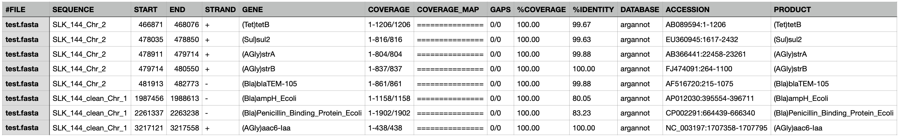
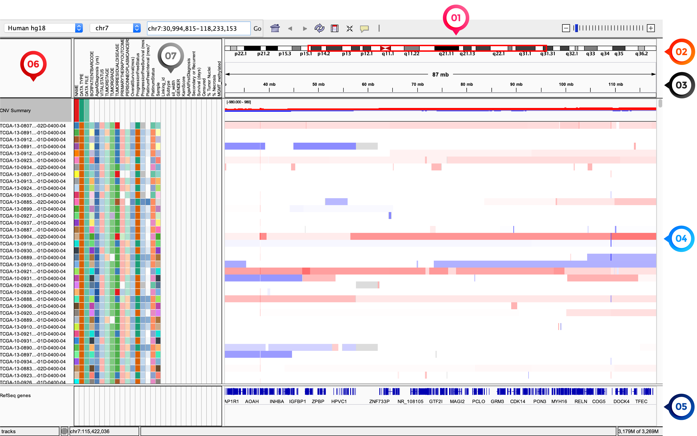

.. _ngs-annotations:

*****************
Genome annotation
*****************

Introduction
############

1. After you performed de novo assembled using raw sequence reads, it is useful to know what **relevant genomic features** are on the produced contigs.

2. Genome annotation is the process that allows us to **identify** features of interest in those contigs and to **label** them with useful information.

3. In this section, you will use |bakta| for whole-genome annotation, |abricate| for a more specific one and `IGV <https://igv.org/doc/desktop/>`_ for its interactive visualisation. In the end, you will evaluate assembly completeness using |busco|. The detection of antimicrobial resistance genes and mutations, and of plasmids, will be covered in more detail in the next two sections.

4. When it comes to annotation process there are two key concepts, **Sequence Ontology** and **Gene Ontology**, that you should understand before you move forward.

Sequence Ontology (SO)
**********************

* SO is a **structured controlled vocabulary** of terms and the relationships between them useful to describe features of a genomic annotation [EILBECK2005]_.

* This vocabulary definition is vital for the exchange, analysis and management of genomic data.

* If you open a **GenBank annotation file**, you will see several demonstrations of SO terms (e.g., the term `CDS <http://sequenceontology.org/browser/current_svn/term/SO:0000316>`_ is defined as a contiguous sequence which begins with, and includes, a start codon and ends with, and includes a stop codon).

.. seealso::
   To understand the **definition of all SO terms** available you can go to the `Sequence Ontology Browser <http://www.sequenceontology.org/browser/obob.cgi>`_ and search for each one.

Gene Ontology (GO)
******************

* |go| is a controlled vocabulary that correlates each gene to one or more functions [ALBERT2019]_.

* The |go| structure can be represented as a graph where nodes are the GO terms, and the edges are the associations between these terms.

* Each child node is more “specific” than its parent, and function is “inherited” down the line.

* |go| has three structured, independent sub-ontologies that describe our knowledge of the gene products:

  1. **Molecular Function** - The molecular-level activities performed by the gene product.
  2. **Cellular Component** - The locations relative to cellular structures where the gene product performs a function.
  3. **Biological Process** - The larger processes accomplished by multiple molecular activities.

.. seealso::
   You can search for GO terms or Gene products in `The Gene Ontology Resource <http://geneontology.org/>`_ official webpage.

Learning objectives
###################

After finishing this Tutorial section, you will be able to:

* Make gene predictions of assembled genomes.
* Evaluate the presence of specific genes conferring adaptive features.
* Evaluate assembly completeness through the search of orthologues presence or absence.
* Use specific software to visualise and edit genome annotations.

Preparing the genomes
#####################

From now on, you will analyse **several genomes** with the same commands. For that, put all the final assemblies in the same directory, ``~/tutorial/genomes``, using the same naming convention (``<sample>.fasta``). Besides your own hybrid assemblies (strainA and strainB), this directory already contains the public genomes that you downloaded in the :ref:`Data acquisition <ngs-data>` section (Sakai, EC958, K12 and LT2).

.. code-block:: bash

   # Copy the final hybrid assemblies of your samples to the genomes directory
   while read -r sample; do
      cp ~/tutorial/assembly/unicycler/${sample}_unicycler.fasta ~/tutorial/genomes/${sample}.fasta
   done < ~/tutorial/samples.txt

   # Check all the genomes that you will analyse
   $ ls -lh ~/tutorial/genomes/
   $ grep -c '>' ~/tutorial/genomes/*.fasta

.. note::
   If you were not able to run |unicycler|, you can also use the |spades| assemblies (``~/tutorial/assembly/spades/<sample>_spades_untrimmed.fasta``), or download the final hybrid assemblies from the :ref:`Downloads <ngs-downloads>` section. Keep in mind that the plasmids will be more fragmented in the short-read assemblies.

Whole-genome annotation
#######################

Bakta
*****

* |bakta| - is a tool for the rapid & standardised annotation of bacterial genomes and plasmids from both isolates and MAGs [SCHWENGERS2021]_.

* The annotation process of |bakta| relies on several external feature prediction tools and has many advantages:

  1. It provides a comprehensive annotation workflow including the detection of small proteins taking into account replicon metadata.

  2. The annotation of coding sequences is accelerated via an alignment-free sequence identification approach that in addition facilitates the precise assignment of public database cross-references.

  3. Annotation results are exported in GFF3 and International Nucleotide Sequence Database Collaboration (INSDC)-compliant flat files, as well as comprehensive JSON files, facilitating automated downstream analysis.

* You will use |bakta| to annotate all your bacterial assemblies from |spades| and |unicycler|.

Installation
............

.. code-block:: bash

   # Create a new environment named bakta
   $ mamba create -n bakta

   # Activate the Bakta environment
   $ conda activate bakta

   # Install Bakta with conda
   $ mamba install bakta

   # Check Bakta installation
   $ bakta --version

Usage
.....

.. warning::

   * You will need at least 8-12 Gb of RAM to be able to run |bakta| with the full database, and ~85 Gb of free disk space (the download has ~30 Gb).

   * If you are unable to run |bakta| please download the final hybrid annotations using this `link <https://mega.nz/folder/4uZymaKb#xL9gxvv7gDFqMXMTu5J63g>`_.

**1. Input/Output files**

``Input``: Bacterial genomes and plasmids (complete/draft assemblies) in (zipped) ``.fasta`` format.

``Output``: Annotation results are provided in standard bioinformatics file formats. A particular attention should be given to ``.gff3`` and ``.gbff`` (information about the annotated features), ``.txt`` (summary of annotated features), ``.faa`` (protein sequences of annotated genes), and ``.ffn`` (nucleotide sequences of annotated genes).

**2. Basic commands**

.. code-block:: bash

   # Let's first create new directories to store your annotations
   $ cd ~/tutorial
   $ mkdir annotation
   $ cd ~/tutorial/annotation/
   $ mkdir bakta abricate busco
   $ cd bakta/

   # List the available versions of the Bakta database
   $ bakta_db list

   # Download the mandatory database for Bakta
   # The "light" database (~1.3 Gb download, ~4 Gb on disk) is enough for this Tutorial
   $ bakta_db download --output ~/databases/bakta --type light

   # Or download the "full" database (~30 Gb download, ~85 Gb on disk) to get the most detailed annotation
   $ bakta_db download --output ~/databases/bakta --type full

   # Run Bakta in your assembled genomes using the .fasta file
   # With the light database use ~/databases/bakta/db-light; with the full database use ~/databases/bakta/db
   $ bakta --db ~/databases/bakta/db-light --threads 4 --verbose --output ~/tutorial/annotation/bakta/strainA --prefix strainA ~/tutorial/genomes/strainA.fasta

.. warning::
   Do not delete the downloaded ``.tar.xz`` archive while ``bakta_db`` is still running; it removes it by itself at the end.

.. note::
   If Bakta stops with the error ``amrfinder error! error code: 1``, the AMRFinderPlus database included in the Bakta database is older than your AMRFinderPlus software. Update it with:
   ``amrfinder_update --force_update --database ~/databases/bakta/db-light/amrfinderplus-db``

.. csv-table:: Parameters explanation when using Bakta
   :header: "Parameter", "Description"
   :widths: 20, 60

   "``--db DB``", "Database path (default = <bakta_path>/db)"
   "``--complete``", "All the sequences are complete replicons (e.g., a hybrid assembly closed with Unicycler); it must not be used with draft assemblies"
   "``--locus-tag TAG``", "Locus tag prefix of the annotated features (e.g., ``STRAINA``)"
   "``--force``", "Overwrite an existing output directory"
   "``--verbose``", "Print verbose information"
   "``--output OUTPUT``", "Output directory (default = current working directory)"
   "``--prefix PREFIX``", "Prefix for output files"
   "``--threads THREADS``", "Number of threads to use (default = number of available CPUs)"
   "``<genome>``", "Genome sequences in (zipped) fasta format"
   "``--genus GENUS``", "Genus name"
   "``--species SPECIES``", "Species name"
   "``--strain STRAIN``", "Strain name"
   "``--plasmid PLASMID``", "Plasmid name"
   "``--compliant``", "Force Genbank/ENA/DDJB compliance"

.. seealso::

   * `RAST <https://rast.nmpdr.org/>`_ web tool is an excellent alternative if you want a more **detailed annotation** and **pathway analysis** of your genome that is not provided with other tools.

   * However, you need to upload the assemblies one by one, and usually, it can take **several minutes** to run a genome.

**3. Running Bakta in several genomes**

.. code-block:: bash

   $ cd ~/tutorial
   $ mkdir -p logs
   for genome in genomes/*.fasta; do
      sample=$(basename $genome .fasta)
      echo "Annotating ${sample}"
      bakta --db ~/databases/bakta/db-light --threads 4 \
         --output annotation/bakta/${sample} --prefix ${sample} --locus-tag ${sample} \
         $genome > logs/${sample}_bakta.log 2>&1
   done

   # Check the summary of the annotation of all the genomes (number of CDS, tRNAs, etc.)
   $ grep -H "^CDSs" annotation/bakta/*/*.txt

.. hint::
   Add ``--complete`` to the command for genomes that are closed (e.g., the public genomes Sakai, EC958, K12 and LT2). For the draft assemblies (e.g., SPAdes), do not use it.

**4. Additional options**

.. code-block:: bash

   # To see a full list of available options in Bakta
   $ bakta --help

Specific annotations
####################

ABRicate
********

* If you prefer to look for genes encoding for specific adaptive features in your genome, you can use |abricate|.

* This tool allows the mass screening of contigs for antimicrobial resistance or virulence genes.

* One of its main assets is that it comes with important **pre-downloaded databases** such as:

  1. `NCBI <https://www.ncbi.nlm.nih.gov/bioproject/PRJNA313047>`_ - NCBI Bacterial Antimicrobial Resistance Reference Gene Database, used by the AMRFinderPlus tool [FELDGARDEN2019]_.
  2. `CARD <https://card.mcmaster.ca/>`_ - Comprehensive Antibiotic Resistance Database [ALCOCK2020]_.
  3. `ARG-ANNOT <https://www.mediterranee-infection.com/acces-ressources/base-de-donnees/arg-annot-2/>`_ (``argannot``) - Antibiotic Resistance Gene-ANNOTation [GUPTA2014]_.
  4. `ResFinder <https://genepi.food.dtu.dk/resfinder>`_ - identification of acquired antimicrobial resistance genes [ZANKARI2012]_.
  5. `MEGARes <https://megares.meglab.org/>`_ - identification of antimicrobial resistance genes from metagenomic datasets [DOSTER2020]_.
  6. `EcOH <https://github.com/katholt/srst2/tree/master/data>`_ - accurate serotype of *E. coli* isolates from raw WGS data [INGLE2016]_.
  7. `PlasmidFinder <https://cge.food.dtu.dk/services/PlasmidFinder/>`_ - *in-silico* detection of plasmid replicons [CARATTOLI2014]_.
  8. `Ecoli_VF <https://github.com/phac-nml/ecoli_vf>`_ - database of *E. coli* virulence factors from VFDB plus additional factors from the literature.
  9. `VFDB <http://www.mgc.ac.cn/VFs/>`_ - Virulence Factor DataBase [CHEN2016]_.
  10. Other databases that are also included in recent versions: ``upec_expec_vf`` (virulence factors of uropathogenic and extra-intestinal *E. coli*), ``victors`` (virulence factors), and ``bacmet2`` (biocide and metal resistance genes; protein database).

* In this section you will annotate your genomes in ``.fasta`` format using |abricate| and look for the presence of specific genes.

.. attention::
   |abricate| uses BLAST to compare the genomes with the databases; thus, it detects the **presence of genes** (e.g., acquired resistance genes) but it does **not** detect resistance caused by **point mutations** (e.g., in *gyrA*). It is a fast and simple screening tool. In the next section, you will use more specialised tools, ResFinder/PointFinder and AMRFinderPlus, that also detect mutations.

Installation
............

.. code-block:: bash

   # Create the abricate environment and install ABRicate
   $ mamba create -n abricate abricate

   # Activate the abricate environment
   $ conda activate abricate

   # Check ABRicate installation
   $ abricate --version
   $ abricate --check

   # See the list of installed databases in ABRicate
   $ abricate --list

.. warning::
   Some of the |abricate| dependencies (Perl modules) are not available for macOS with Apple Silicon (M1/M2/M3...). If the installation fails, create the environment using the Intel architecture: ``CONDA_SUBDIR=osx-64 mamba create -n abricate abricate``.

Usage
.....

**1. Input/Output files**

``Input``: It accepts any compressed or uncompressed sequence file that can be converted to ``FASTA`` format by ``any2fasta`` (e.g., GenBank, EMBL). You can provide several files at the same time.

``Output``: A tab-separated file containing the following columns:

*Figure 18. Example of an ABRicate report using the ARG-ANNOT database. From left to right you can see the following columns: the filename, the sequence in the filename, start and end coordinates in the sequence, strand, gene name, what proportion of the gene is in your sequence, a visual representation of the hit, gaps in subject and query, the proportion of gene covered, the proportion of exact nucleotide matches, database name, accession number of the sequence source, and gene product (if available).*

**2. Basic commands**

.. code-block:: bash

   # Let's first go to the directory where we want to store ABRicate results
   $ cd ~/tutorial/annotation/abricate/

   # Run ABRicate database ResFinder in all your genomes (FASTA format) at the same time
   $ abricate --db resfinder --quiet --threads 4 ~/tutorial/genomes/*.fasta > resfinder_ann.tab

   # Run ABRicate database PlasmidFinder in your genomes (FASTA format)
   $ abricate --db plasmidfinder --quiet --threads 4 ~/tutorial/genomes/*.fasta > plasmidfinder_ann.tab

   # Run ABRicate database Ecoli_VF in your genomes (FASTA format)
   $ abricate --db ecoli_vf --quiet --threads 4 ~/tutorial/genomes/*.fasta > ecoli_vf_ann.tab

   # Run ABRicate database EcOH in your genomes (FASTA format)
   $ abricate --db ecoh --quiet --threads 4 ~/tutorial/genomes/*.fasta > ecoh_ann.tab

   # Generate a summary report for each analysis (one row per genome)
   $ abricate --summary resfinder_ann.tab > resfinder_ann_summary.tab
   $ abricate --summary plasmidfinder_ann.tab > plasmidfinder_ann_summary.tab
   $ abricate --summary ecoli_vf_ann.tab > ecoli_vf_summary.tab
   $ abricate --summary ecoh_ann.tab > ecoh_summary.tab

   # Visualise the summary table in the terminal
   $ column -t -s $'\t' resfinder_ann_summary.tab | less -S

.. note::
   The ``--summary`` table only lists the genomes in which at least one gene was found. A genome without hits (e.g., K12 in ResFinder) does not appear in the table. The first column is the path of the file; to see only the sample name use ``sed 's#.*/##; s#\.fasta##'``.

You do not need a loop to run |abricate| in several genomes since it accepts many files. However, if you want to run **all the databases** at once, use a loop over the databases:

.. code-block:: bash

   # Run all the main databases and save one table per database
   for db in ncbi card resfinder argannot plasmidfinder vfdb ecoli_vf; do
      abricate --db $db --quiet --threads 4 --minid 90 --mincov 80 ~/tutorial/genomes/*.fasta > ${db}_ann.tab
      abricate --summary ${db}_ann.tab > ${db}_summary.tab
   done

   # Count the number of genes found in each genome in each database
   $ for file in *_ann.tab; do echo "== $file"; tail -n +2 $file | cut -f 1 | sort | uniq -c; done

.. csv-table:: Parameters explanation when using ABRicate
   :header: "Parameter", "Description"
   :widths: 20, 60

   "``--db [X]``", "Database to use (default 'ncbi')"
   "``--quiet``", "Quiet mode, no stderr output"
   "``--minid [n.n]``", "Minimum DNA %identity (default: 80)"
   "``--mincov [n.n]``", "Minimum DNA %coverage (default: 80)"
   "``--threads [N]``", "Number of BLAST+ threads (default: 1)"
   "``--summary``", "Summarise multiple reports into a table (genomes as rows, genes as columns)"
   "``abricate-get_db --db NAME``", "Re-use existing download and just regenerate the database"
   "``abricate-get_db --db NAME --force``", "Force download of latest version of a database"

**3. Additional options**

.. code-block:: bash

   # To see a full list of available options in ABRicate
   $ abricate --help

.. todo::
   1. Run |bakta| and |abricate| in your hybrid assembled genomes and in the public genomes using the ``.fasta`` files.
   2. Did your isolates carry putative antimicrobial resistance or virulence genes? Which ones are present?
   3. How many coding sequences (CDS) were predicted in each genome?
   4. Which genome carries more resistance genes: EC958, Sakai, K12 or LT2? Is it what you expected?
   5. Which plasmid replicons were found in each genome? Do they match the plasmids that you saw in the ``.fasta`` headers?

.. seealso::
   * Although you use draft assembled genomes for this specific annotation process, it is also viable to use the initial **raw sequence reads** using for example `ARIBA <https://github.com/sanger-pathogens/ariba>`_.

   * Yet, it is essential to highlight that assembled sequences facilitate an understanding of the genetic context of the resistance mechanism by assessing, for example, gene synteny, mutations on regulatory regions or co-localisation with other genes [KWONG2017]_.

Interactive visualisation
#########################

IGV
***

* The Integrative Genomics Viewer - `IGV <https://igv.org/doc/desktop/>`_ is a freely-available and interactive high-performance desktop tool for visualisation of diverse genomic data [THORVALDSDOTTIR2013]_.

* In this section we will use IGV to explore our previous genome annotations.

* There are a panoply of other desktop applications for visualisation of genomic data that you can also explore such as `Geneious <https://www.geneious.com/>`_, `UGENE <http://ugene.net/>`_, `Tablet <https://ics.hutton.ac.uk/tablet/>`_, or `Artemis <https://sanger-pathogens.github.io/Artemis/>`_.

Installation
............

1. Download the latest IGV with Java included for Mac, Linux or Windows using the link provided `here <https://igv.org/doc/desktop/#DownloadPage/>`_.

2. Unzip the content on your computer.

*Figure 19. Visualisation of the main window of IGV showing data from The Cancer Genome Atlas. 1 - IGV toolbar to access commonly used features; 2 - red box indicates the portion of the chromosome that is displayed; 3 - the ruler reflects the visible part of the chromosome; 4 - data is shown in horizontal rows called tracks; 5 - gene features; 6 - track names; 7 - optional attribute panel represented as coloured blocks.*

Usage
.....

1. Open IGV in your computer by running ``igv.sh`` (Linux and macOS) or ``igv-launcher.bat`` (Windows).

2. Go to ``Genomes`` -> ``Load Genome from File``.

3. Choose a genome assembly to load from your computer in ``.fasta`` format.

4. To load tracks go to ``File`` -> ``Load from File``.

5. Choose the annotation file from your computer in ``.gff3`` format (e.g., the one created by |bakta|).

6. Move your cursor to right and left to see the predicted genes.

7. Try to find a gene of interest (e.g., **mdf(A)**, or a **bla** gene if present) using the ``Go`` search box.

8. Zoom in the gene to see its sequence (DNA and protein).

9. What is the correct reading frame for this gene?

.. seealso::
   For detailed information about IGV please see the full `manual <https://igv.org/doc/desktop/>`_.

.. todo::
   6. Visualize your genome annotations using Integrative Genomics Viewer - `IGV <https://igv.org/doc/desktop/>`_ as explained above. Try to identify the *mdf(A)* gene (and a *bla* gene, if your strain has one).

Assembly completeness
#####################

Busco
*****

* In the previous section you performed a *de novo* assembled and evaluated its quality using |quast|. However, most of these quality metrics, although informative, can also be misleading.

* In this section you will use |busco| - Benchmarking Universal Single-Copy Orthologs - to assess the completeness of genomes, using their **gene content** as a complementary method to other technical metrics [SEPPEY2019]_.

* For this, |busco| will find in your genome assembly, **marker genes** that are conserved across a range of species; being their presence a good indication of quality.

Installation
............

.. code-block:: bash

   # Create a new environment and install busco at the same time
   $ mamba create -n busco busco

   # Activate the busco environment
   $ conda activate busco

   # Check BUSCO installation
   $ busco --version

   # See a list of all available datasets in BUSCO
   # When running an analysis BUSCO will download the dataset automatically
   $ busco --list-datasets

Usage
.....

**1. Input/Output files**

``Input``: Accepts a genome assembly, an annotated gene set, or a transcriptome assembly. If you provide a **directory**, BUSCO runs in *batch mode* and analyses all the FASTA files inside it.

``Output``: Several files are produced, although particular attention should be paid to ``short_summary.txt`` (a short summary of BUSCO report), ``full_table.tsv`` (list of all BUSCO genes), and ``missing_busco_list.tsv`` (list of missing BUSCO genes). In batch mode, a ``batch_summary.txt`` file with the results of all the genomes is also created.

**2. Basic commands**

.. code-block:: bash

   # Let's first go to the directory where we want to store the BUSCO results
   # (the directory ~/tutorial/annotation/busco was already created before)
   $ cd ~/tutorial/annotation/busco/

   # Run BUSCO in one of your assembled genomes (.fasta format)
   $ busco -i ~/tutorial/genomes/strainA.fasta -o strainA -l bacteria_odb12 -m genome -c 4

   # Or run BUSCO in the proteins annotated by Bakta (.faa format)
   $ busco -i ~/tutorial/annotation/bakta/strainA/strainA.faa -o strainA_prot -l bacteria_odb12 -m proteins -c 4

   # Run BUSCO in all your genomes at the same time (batch mode): provide the directory with the .fasta files
   $ busco -i ~/tutorial/genomes -o all_genomes -l bacteria_odb12 -m genome -c 4

   # See the summary of all the genomes
   $ column -t -s $'\t' all_genomes/batch_summary.txt | cut -c 1-110

   # Plot the results obtained by BUSCO: copy the summaries of all the genomes into a directory and plot them
   $ mkdir plot
   $ cp all_genomes/*/short_summary.specific.*.json plot/
   $ busco --plot plot

   # Open BUSCO .png image in Ubuntu/WSL
   $ sensible-browser plot/busco_figure.png

   # Or open BUSCO .png image in macOS
   $ open plot/busco_figure.png

.. note::
   * BUSCO 5 used the ``odb10`` datasets (e.g., ``bacteria_odb10``) and a separate script ``generate_plot.py``. BUSCO 6 uses by default the ``odb12`` datasets (e.g., ``bacteria_odb12``) and the plot is generated with ``busco --plot``.

   * For *E. coli* and *Salmonella* you can also use a more specific dataset: ``enterobacterales_odb12``. Use ``busco --list-datasets`` to see all the datasets.

   * The first time that you run BUSCO it downloads the dataset into the directory ``busco_downloads``. Use ``--download_path`` to choose a directory shared by all your analyses.

.. csv-table:: Parameters explanation when using BUSCO
   :header: "Parameter", "Description"
   :widths: 20, 60

   "``-i [X]``", "Input file to analyse which is either a nucleotide fasta (``.fasta``) file or a protein fasta file (``.faa``), or a directory with several files (batch mode)"
   "``-o [X]``", "Name of the folder that will contain all results, logs, and intermediate data"
   "``-l [X]``", "Lineage database name that BUSCO will use to assess orthologue presence absence"
   "``-m [X]``", "Sets the assessment mode, e.g., genome, proteins, transcriptome"
   "``-c [N]``", "Number of threads/cores to use"
   "``-f``", "Force rewriting of existing output files"
   "``--auto-lineage-prok``", "Automatically select the best prokaryotic lineage (instead of ``-l``)"
   "``--out_path [X]``", "Directory where the results folder will be created (default: current directory)"

**3. Additional options**

.. code-block:: bash

   # To see a full list of available options in BUSCO
   $ busco --help

.. todo::
   7. Run |busco| in the hybrid assemblies from Unicycler and in the public genomes (batch mode).
   8. How many marker genes have BUSCO found? How many are absent?
   9. Do you think that your results are good in terms of genome annotation completeness? Why?

Folder structure
################

At the end of this section, you will have the following folder structure.

::

    tutorial
    ├── samples.txt
    ├── public_genomes.tsv
    ├── raw_data
    │   ├── <sample>_R1.fastq.gz
    │   ├── <sample>_R2.fastq.gz
    │   ├── <sample>_nanopore.fastq.gz
    │   ├── files.fasta
    │   ├── files.gbk
    │   ├── files.gff
    ├── genomes
    │   ├── <sample>.fasta
    │   ├── Sakai.fasta
    │   ├── EC958.fasta
    │   ├── K12.fasta
    │   ├── LT2.fasta
    ├── qc_visualisation
    │   ├── trimmed
    │   ├── untrimmed
    ├── qc_improvement
    ├── taxonomy
    │   ├── kraken_bracken
    │   ├── krona
    ├── assembly
    │   ├── spades
    │   ├── unicycler
    │   ├── bandage
    │   ├── quast
    ├── annotation
    │   ├── bakta
    │   │   ├── <genome>
    │   │   │   ├── <genome>.gff3
    │   │   │   ├── <genome>.gbff
    │   │   │   ├── <genome>.txt
    │   │   │   ├── <genome>.faa
    │   │   │   ├── <genome>.ffn
    │   ├── abricate
    │   │   ├── resfinder_ann.tab
    │   │   ├── resfinder_ann_summary.tab
    │   │   ├── plasmidfinder_ann.tab
    │   │   ├── plasmidfinder_ann_summary.tab
    │   │   ├── ecoli_vf_ann.tab
    │   │   ├── ecoh_ann.tab
    │   ├── busco
    │   │   ├── all_genomes
    │   │   ├── plot
    ├── logs

References
##########

.. [ALCOCK2020] Alcock BP, et al. 2020. CARD 2020: antibiotic resistome surveillance with the comprehensive antibiotic resistance database. Nucleic Acids Res. 48(D1):D517–D525. `DOI: 10.1093/nar/gkz935 <https://dx.doi.org/10.1093/nar/gkz935>`_.
.. [CARATTOLI2014] Carattoli A, et al. 2014. In Silico Detection and Typing of Plasmids using PlasmidFinder and Plasmid Multilocus Sequence Typing. Antimicrob Agents Chemother. 58(7):3895–3903. `DOI: 10.1128/AAC.02412-14 <https://dx.doi.org/10.1128/AAC.02412-14>`_.
.. [CHEN2016] Chen L, et al. 2016. VFDB 2016: hierarchical and refined dataset for big data analysis—10 years on. Nucleic Acids Res. 44(DI):D694–D697. `DOI: 10.1093/nar/gkv1239 <https://dx.doi.org/10.1093/nar/gkv1239>`_.
.. [DOSTER2020] Doster E, et al. 2020. MEGARes 2.0: a database for classification of antimicrobial drug, biocide and metal resistance determinants in metagenomic sequence data. Nucleic Acids Res. 48(D1):D561–D569. `DOI: 10.1093/nar/gkz1010 <https://dx.doi.org/10.1093/nar/gkz1010>`_.
.. [EILBECK2005] Eilbeck K, et al. 2005. The Sequence Ontology: a tool for the unification of genome annotations. Genome Biol. 6(5):R44. `DOI: 10.1186/gb-2005-6-5-r44 <https://dx.doi.org/10.1186/gb-2005-6-5-r44>`_.
.. [FELDGARDEN2019] Feldgarden M, et al. 2019. Validating the AMRFinder Tool and Resistance Gene Database by Using Antimicrobial Resistance Genotype-Phenotype Correlations in a Collection of Isolates. Antimicrob Agents Chemother. 63(11):e00483-19. `DOI: 10.1128/AAC.00483-19 <https://dx.doi.org/10.1128/AAC.00483-19>`_.
.. [GUPTA2014] Gupta AK, et al. 2014. ARG-ANNOT, a new bioinformatic tool to discover antibiotic resistance genes in bacterial genomes. Antimicrob Agents Chemother. 58(1):212-20. `DOI: 10.1128/AAC.01310-13 <https://dx.doi.org/10.1128/AAC.01310-13>`_.
.. [INGLE2016] Ingle DJ, et al. 2016. In silico serotyping of E. coli from short read data identifies limited novel O-loci but extensive diversity of O:H serotype combinations within and between pathogenic lineages. Microb Genom. 2(7):e000064. `DOI: 10.1099/mgen.0.000064 <https://dx.doi.org/10.1099/mgen.0.000064>`_.
.. [KWONG2017] Kwong JC, et al. 2017. Comment on: Benchmarking of methods for identification of antimicrobial resistance genes in bacterial whole genome data. J Antimicrob Chemother. 72(2):635-636. `DOI: 10.1093/jac/dkw473 <https://dx.doi.org/10.1093/jac/dkw473>`_.
.. [SCHWENGERS2021] Schwengers O, et al. 2021. Bakta: rapid and standardized annotation of bacterial genomes via alignment-free sequence identification. Microbial Genomics. 7(11):000685. `DOI: 10.1099/mgen.0.000685 <https://dx.doi.org/10.1099/mgen.0.000685>`_.
.. [SEPPEY2019] Seppey M, Manni M, Zdobnov EM. 2019. BUSCO: Assessing Genome Assembly and Annotation Completeness. In: Kollmar M. (eds) Gene Prediction. Methods in Molecular Biology, vol 1962. Humana, New York, NY. 2019. `DOI: 10.1007/978-1-4939-9173-0_14 <https://dx.doi.org/10.1007/978-1-4939-9173-0_14>`_.
.. [THORVALDSDOTTIR2013] Thorvaldsdóttir H, Robinson JT, Mesirov JP. Integrative Genomics Viewer (IGV): high-performance genomics data visualization and exploration. Brief Bioinform. 14(2):178-92. `DOI: 10.1093/bib/bbs017 <https://dx.doi.org/10.1093/bib/bbs017>`_.
.. [ZANKARI2012] Zankari E, et al. 2012. Identification of acquired antimicrobial resistance genes. J Antimicrob Chemother. 67(11):2640-4. `DOI: 10.1093/jac/dks261 <https://dx.doi.org/10.1093/jac/dks261>`_.
