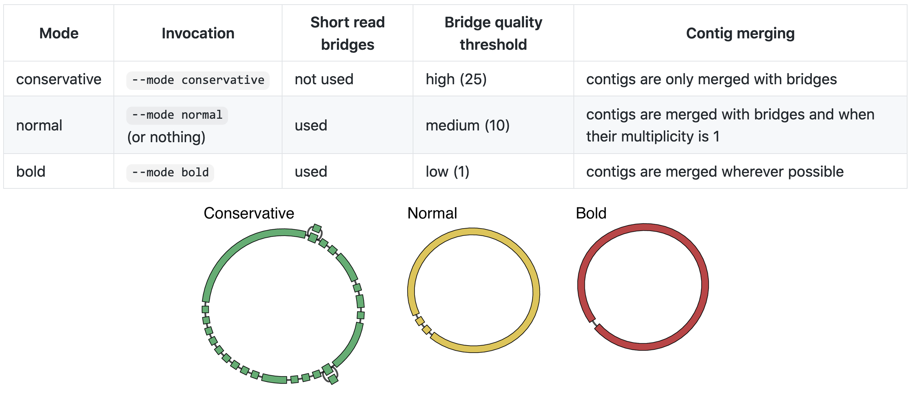
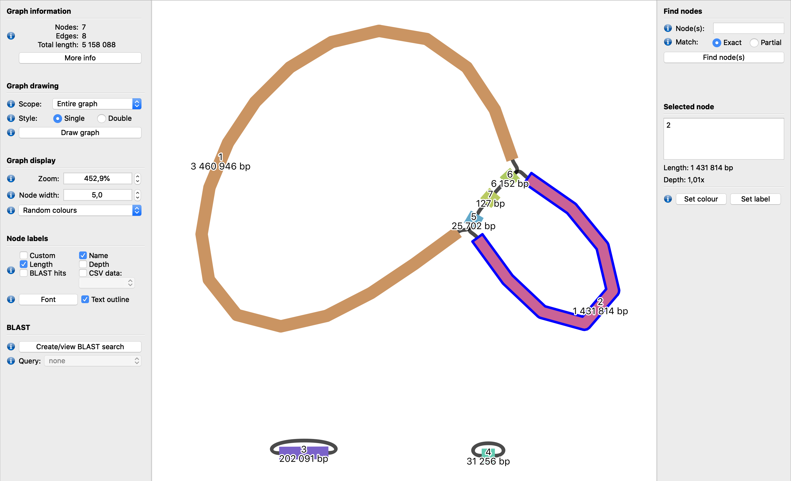
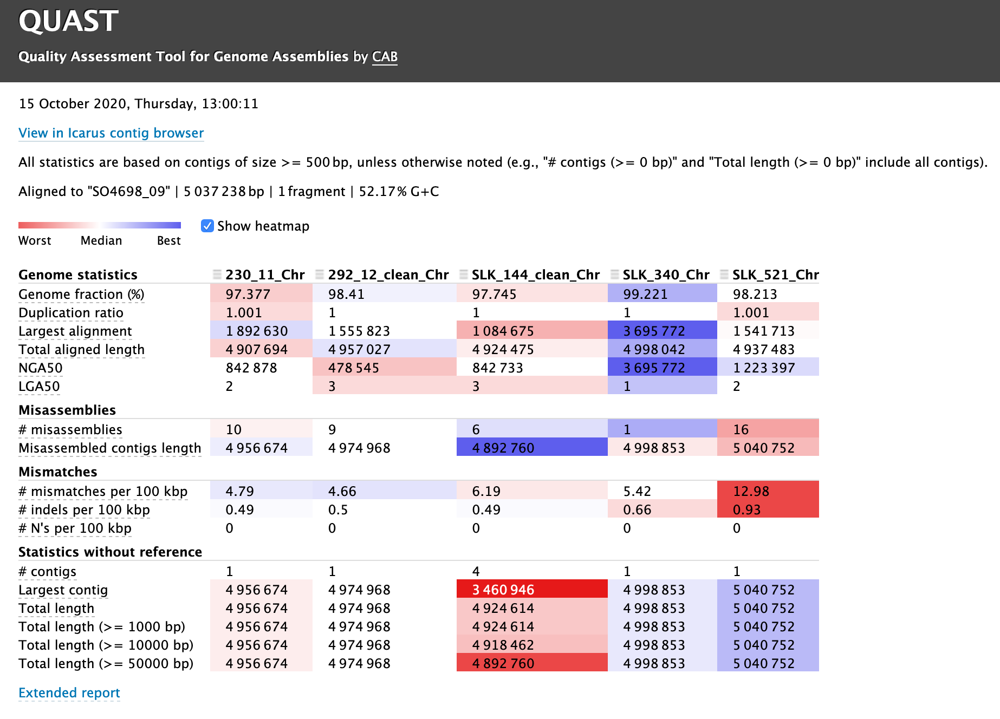

.. _ngs-assembly:

*************************
*De novo* genome assembly
*************************

Introduction
############

1. An assembly is the reconstruction of genomes through DNA sequencing. Since it is impossible to sequence all genome base-by-base, we need to reconstruct it indirectly [MILLER2010]_.

2. For that we use *de novo* assembly tools that overlap sequence **raw reads** into larger contiguous sequences, or **contigs**, that in most cases have a lot of gaps.

3. Some tools attempt to join, order and orientate contigs based on read pairs and on assembly graphs (when applied) to produce the genomic **scaffolds**.

4. The most broadly accepted data file format for an assembly is ``FASTA``.

5. In this section you will use |spades| for assembling Illumina-only raw reads and |unicycler| for a hybrid assembly, i.e. when we have Illumina (2nd generation) and PacBio or Nanopore (3rd generation) raw reads.

Learning objectives
###################

After finishing this Tutorial section, you will be able to:

* Perform a *de novo* assembly using raw sequence reads from different platforms.
* Visualize and analyze *de novo* assembly graphs.
* Evaluate the quality of a genome assembly.

Short-read assembly
###################

SPAdes
******

* |spades| - St. Petersburg genome assembler – is an assembly toolkit containing various **assembly pipelines** [BANKEVICH2012]_.

* Besides the typical |spades| module for short- and long-read genome assembly using de Bruijn graphs other additional pipelines are also available such as:

  1. ``hybridSPAdes`` assembling **short and long** reads and benchmark it on a variety of bacterial assembly projects [ANTIPOV2016A]_.
  2. ``metaSPAdes`` for assembly of **metagenomic** data sets [NURK2017]_.
  3. ``plasmidSPAdes`` for extracting and assembling **plasmids** from whole-genome sequencing data [ANTIPOV2016B]_.
  4. ``metaplasmidSPAdes`` – a pipeline for extracting and assembling **plasmids from metagenomic** data sets [ANTIPOV2019]_.
  5. ``rnaSPAdes`` – a de novo transcriptome assembler from **RNA-Seq** data [BUSHMANOVA2019]_.
  6. ``truSPAdes`` – a module for **TruSeq** barcode assembly [BANKEVICH2016]_.
  7. ``biosyntheticSPAdes`` – a module for **biosynthetic** gene cluster assembly with paired-end reads [MELESHKO2019]_.

Installation
............

.. note::
   Since |spades| is a dependency of |unicycler| we only need to install the last one to have access to both tools.

.. code-block:: bash

   # Deactivate all the current environments
   $ conda deactivate

   # Create a new environment named assembly
   $ conda create -n assembly python=3.8

   # Activate the new environment
   $ conda activate assembly

   # Install Unicycler and its dependencies (including SPAdes)
   $ conda install -c bioconda unicycler

   # Check SPAdes installation
   $ spades.py --version
   $ spades.py --test

.. note::
   If the installation is successful, you will find the following information at the end of the Bash shell ``TEST PASSED CORRECTLY``.

Usage
.....

**1. Input/Output files**

``Input``: Accept compress or uncompress files such as ``.fastq`` or ``.fastq.gz``. For this part of the Tutorial, we will use the paired-end Illumina raw reads.

``Output``: Several files are produced by |spades|. However, particular attention will be given to ``contigs.fasta`` (contains resulting contigs in FASTA format), ``scaffolds.fasta`` (contains resulting scaffolds in FASTA format), ``assembly_graph.gfa`` (contains SPAdes assembly graph and scaffolds paths in `GFA v1 <https://github.com/GFA-spec/GFA-spec/blob/master/GFA1.md>`_ format), and ``spades.log`` (SPAdes log).

.. note::
   In most cases, you will use ``contigs.fasta`` file for your further analysis, since ``scaffolds.fasta`` will add NNNNNNNs to your file every time that two or more smaller contigs are supposed to be connected, but it cannot fill in the small gap between them.

**2. Basic commands**

.. code-block:: bash

   # Let's first create new directories to store your assemblies
   $ cd ~/tutorial
   $ mkdir assembly
   $ cd ~/tutorial/assembly/
   $ mkdir spades unicycler
   $ cd ~/tutorial/assembly/spades

   # Run SPAdes in your untrimmed and trimmed (if applied) paired-end Illumina reads
   $ spades.py -1 ~/tutorial/raw_data/strainA_untrimmed_R1.fastq.gz -2 ~/tutorial/raw_data/strainA_untrimmed_R2.fastq.gz --careful -k 21,33,55,77 -t 4 --cov-cutoff auto -o strainA_untrimmed
   $ spades.py -1 ~/tutorial/raw_data/strainA_trimmed_R1.fastq.gz -2 ~/tutorial/raw_data/strainA_trimmed_R2.fastq.gz --careful -k 21,33,55,77 -t 4 --cov-cutoff auto -o strainA_trimmed

.. csv-table:: Parameters explanation when using SPAdes
   :header: "Parameter", "Description"
   :widths: 20, 60

   "``-1 <filename>``", "File with forward paired-end reads"
   "``-2 <filename>``", "File with reverse paired-end reads"
   "``--careful``", "Tries to reduce number of mismatches and short indels"
   "``-k <int>``", "list of k-mer sizes (must be odd and less than 128) [default: 'auto']"
   "``-t <int>``", "Number of threads [default: 16]"
   "``-o <output_dir>``", "Directory to store all the resulting files (required)"
   "``--isolate``", "Improves the assembly quality and running time"
   "``--cov-cutoff``", "Read coverage cutoff value. Must be a positive float value, or 'auto', or 'off'"

.. attention::
   If you have high-coverage data for bacterial isolate, |spades| developers highly recommend to use the ``--isolate`` option that is not compatible with ``--careful`` option; thus, you must disable the last one.

**3. Additional options**

.. code-block:: bash

   # To see a full list of available options in SPAdes
   $ spades.py --help

.. todo::
   1. Run |spades| assembler in your trimmed and untrimmed paired-end Illumina reads.

Hybrid assembly
###############

Unicycler
*********

* |unicycler| is mainly used for **hybrid assembly** of bacterial genomes [WICK2017]_.

* For this, it uses both **short-reads** from Illumina and **long-reads** from PacBio or Oxford Nanopore technologies.

* Additionally, it can also assemble Illumina-only reads, although in this case, it will only function as a **SPAdes-optimiser** (it will take more time to run that |spades|; however it will offer some optimisation benefits).

* |unicycler| can also assembly long-read-only sets (PacBio or Nanopore), although in this case a new tool named `Trycycler <https://github.com/rrwick/Trycycler/wiki>`_ from the same developers of |unicycler| should be used instead.

Installation
............

.. note::
   We already installed |unicycler| and |spades| in the previous section.

.. code-block:: bash

  # Check Unicycler installation

  $ conda activate assembly
  $ unicycler --version

Usage
.....

**1. Input/Output files**

``Input``: Accept uncompress or compress files such as ``.fastq`` or ``.fastq.gz``. For this part of the Tutorial, we will use the paired-end Illumina and Nanopore raw reads.

``Output``: Several files are produced by |unicycler|. However, particular attention will be given to ``assembly.fasta`` (final assembly in FASTA format), ``assembly.gfa`` (final assembly in `GFA v1 <https://github.com/GFA-spec/GFA-spec/blob/master/GFA1.md>`_ graph format), and ``unicycler.log`` (Unicycler log file).

**2. Basic commands**

.. warning::

   * You will need at least 12 Gb of RAM to be able to run |unicycler|.

   * If you are unable to run |unicycler| please download the final hybrid assembly using this `link <https://mega.nz/folder/du5DnCgL#UTgfvuksgI66oiRz3ZO2NA>`_.

.. code-block:: bash

   # Let's first move to the directory where you want to store your assemblies
   $ cd ~/tutorial/assembly/unicycler

   # Run Unicycler using the untrimmed paired-end Illumina and Nanopore raw reads
   $ unicycler -1 short_reads_1.fastq.gz -2 short_reads_2.fastq.gz -l long_reads.fastq.gz --mode normal -o output_dir -t 8

.. csv-table:: Parameters explanation when using Unicycler
   :header: "Parameter", "Description"
   :widths: 20, 60

   "``-1 SHORT1``", "FASTQ file of first short reads in each pair (required)"
   "``-2 SHORT2``", "FASTQ file of second short reads in each pair (required)"
   "``-l LONG``", "FASTQ or FASTA file of long reads (optional)"
   "``--mode {conservative,normal,bold}``", "Bridging mode (default: normal)"
   "``-o OUT``", "Output directory (required)"
   "``-t THREADS``", "Number of threads used (default: 8)"

*Figure 15. Specific differences between the three allowed modes. Retrieved from Unicycler official GitHub page.*

**3. Additional options**

.. code-block:: bash

   # To see a full list of available options in Unicycler
   $ unicycler --help

.. todo::
   2. Run |unicycler| for a hybrid assembly using the short-read paired-end Illumina and the long-read Nanopore.

Assembly visualisation
######################

Bandage
*******

* |bandage| - Bioinformatics Application for Navigating De novo Assembly Graphs Easily - is a useful Software for **visualising assembly graphs** and the hidden connections between nodes [WICK2015]_.

* You can easily interact with graphs using the zoom, pan and rotate options, customise the visualisation (e.g., label and colour nodes), search for sequences, extract sequences, and more.

Installation
............

1. Download the 64-bit binary executables for **macOS**, **Windows** or **Linux** using the link provided in |bandage| website.

2. For installation, you just need to unzip the content on your computer.

Usage
.....

.. code-block:: bash

   # Let's first create a new directory to store your graphs
   $ cd ~/tutorial/assembly/
   $ mkdir bandage
   $ cd

1. Open |bandage| in your computer. It will open the Bandage Graphical User Interface (GUI).

2. Go to ``File`` -> ``Load graph``.

3. Choose a graph to load from your computer.

.. hint::
   The graphs were generated by |spades| and |unicycler| in the previous steps and had a **Graphical Fragment Assembly** - ``.gfa`` file extension.

4. After the graph is loaded, click ``Draw graph`` button to draw the graph to the screen.

5. Click on a node to **select** it, or click and drag to **select several** at the same time. You will see appearing on the right side of the window the information about the selected node.

6. You can also move nodes by clicking on a node and dragging it to the new position.

7. Use the mouse to zoom, pan and rotate the graphs.

8. On the left panel, check the boxes ``Lenght``, ``Name``, and ``Text outline`` located on **Node Labels** section, to see information about contigs. However, if you have a lot of contigs by doing this, your graph will be overwhelmed with information.

9. Save all the graphs as ``.png`` images using ``File`` -> ``Save image (entire scene)`` in the directory ``~/tutorial/assembly/bandage/``.

.. seealso::
   For detailed information about |bandage| please see the full `manual <https://github.com/rrwick/Bandage/wiki/Getting-started>`_.

*Figure 16. Visualisation of a assembly graph in Bandage created using paired-end Illumina and Nanopore raw reads.*

Assembly quality control
########################

* Quality control metrics of a genome assembly evaluates the contiguity, completeness (e.g., genome size), and correctness (i.e., proportion of the genome that is free from mistakes) of an assembly.

* Assembly size is usually given by statistics including maximum length, average length, combined total length, and N50.

* In this section you will use |quast| to assess some of the quality metrics of your genome assemblies originated from |spades| and |unicycler|.

QUAST
*****

* |quast|  - **QUality ASsessment Tool** - is a tool that evaluates and compare genome assemblies by computing various metrics [GUREVICH2013]_.

* This tool can be used in single or multiple assemblies from different platforms to compare them and decide what is the best one for your further analysis.

Installation
............

.. code-block:: bash

   # Deactivate all the current environments
   $ conda deactivate

   # Activate the qc environment
   $ conda activate qc

   # Install QUAST
   $ conda install -c bioconda quast

   # Check QUAST installation
   $ quast.py --version

Usage
.....

**1. Input/Output files**

``Input``: Accept assemblies and references in ``.fasta`` format. Genes and operons annotations must be in ``.gff`` or ``.txt`` format. For this part of the Tutorial, we will use the |spades| and |unicycler| assembled draft genomes.

``Output``: QUAST computes various metrics. The most relevant for this Tutorial is the interactive ``.html`` report that contains a summary of the metrics presented in colourful tables and plots.

**2. Basic commands**

.. code-block:: bash

   # Let's first create new directories to store your reports
   $ cd ~/tutorial/assembly/
   $ mkdir quast
   $ cd quast/

   # Run QUAST in your assembly FASTA files
   $ quast.py -o assembly_quast ~/tutorial/assembly/spades/*.fasta ~/tutorial/assembly/unicycler/*.fasta

   # Run QUAST in your assembly FASTA files but provide a reference genome
   $ quast.py -r ~/tutorial/raw_data/reference.fasta -g ~/tutorial/raw_data/annotation.gff -o assembly_quast ~/tutorial/assembly/spades/*.fasta ~/tutorial/assembly/unicycler/*.fasta

   # Open QUAST html report in Ubuntu/WSL
   $ sensible-browser report.html
   $ cd

   # Or open QUAST html report in macOS
   $ open report.html
   $ cd

.. csv-table:: Parameters explanation when using QUAST
   :header: "Parameter", "Description"
   :widths: 20, 60

   "``-o <output_dir>``", "Specify the output directory"
   "``-r <filename>``", "File with reference genome. Most metrics can't be evaluated without reference"
   "``-g <filename>``", "File with genes annotations for given species (GFF, BED, NCBI or TXT)"
   "``<fasta_file(s)>``", "Full path for the assembly FASTA files"

*Figure 17. Example of a QUAST HTML quality report of hybrid assemblies.*

.. seealso::
   Some of the most important metrics that you should pay attention in |quast| **final report** include:

   1. ``# contigs``: is the total **number of contigs** in the assembly.

   2. ``Largest contig``: is the length of the **longest contig** in the assembly.

   3. ``Total length``: is the total number of **bases** in the assembly.

   4. ``GC (%)``: is the total number of **G and C nucleotides** in the assembly, divided by the total length of the assembly.

   5. ``L50``: is the minimal number of contigs that cover 50% of the assembly (contigs equal or longer than N50).

   6. ``N50``: is the length for which the collection of all **contigs** of that length or longer covers at least 50% of the assembly length.

   7. ``NG50``: is the length for which the collection of all **contigs** of that length or longer covers at least 50% of the reference genome.

   8. ``NA50 and NGA50``: is the length for which the collection of **aligned blocks** of that length or longer covers at least 50% of the reference genome.

**3. Additional options**

.. code-block:: bash

   # To see a full list of available options in QUAST
   $ quast.py --help

.. todo::
   3. Assess the quality of both |spades| and |unicycler| assemblies using |quast|.
   4. How many contigs in total did the assemblies produced?
   5. What is the N50 of the assemblies? What does this mean?
   6. Did you noticed any difference in the assembly using trimmed and untrimmed reads? What is the main difference in terms of quality parameters?
   7. Compare |spades| and |unicycler| assemblies. What are the main differences? Did you notice any kind of improvement in genome assembly?

Folder structure
################

At the end of this section, you will have the following folder structure.

::

    tutorial
    ├── raw_data
    │   ├── files_fastq.gz
    │   ├── files.fasta
    │   ├── files.gbk
    │   ├── files.gff
    ├── qc_visualisation
    │   ├── trimmed
    │   │   ├── files_clean_fastqc.html
    │   │   ├── files_clean_fastqc.zip
    │   │   ├── multiqc_clean_report.html
    │   │   ├── multiqc_clean_data
    │   ├── untrimmed
    │   │   ├── files_fastqc.html
    │   │   ├── files_fastqc.zip
    │   │   ├── multiqc_report.html
    │   │   ├── multiqc_data
    ├── qc_improvement
    │   ├── files_clean.fastq.gz
    ├── taxonomy
    │   ├── kraken_bracken
    │   │   ├── files_cseqs_1.fastq
    │   │   ├── files_cseqs_2.fastq
    │   │   ├── output.kraken
    │   │   ├── report.kreport
    │   │   ├── output.bracken
    │   ├── krona
    │   │   ├── output_krona.html
    ├── assembly
    │   ├── spades
    │   │   ├── assembly_spades_trimmed.fasta
    │   │   ├── assembly_spades_trimmed.gfa
    │   │   ├── assembly_spades_trimmed.log
    │   │   ├── assembly_spades_untrimmed.fasta
    │   │   ├── assembly_spades_untrimmed.gfa
    │   │   ├── assembly_spades_untrimmed.log
    │   ├── unicycler
    │   │   ├── assembly_unicycler.fasta
    │   │   ├── assembly_unicycler.gfa
    │   │   ├── assembly_unicycler.log
    │   ├── bandage
    │   │   ├── graphs.png
    │   ├── quast
    │   │   ├── report_without_reference.html
    │   │   ├── report_with_reference.html

References
##########

.. [ANTIPOV2016A] Antipov D, et al. 2016. hybridSPAdes: an algorithm for hybrid assembly of short and long reads. Bioinformatics. 32(7):1009–1015. `DOI: 10.1093/bioinformatics/btv688 <https://dx.doi.org/10.1093/bioinformatics/btv688>`_.
.. [ANTIPOV2016B] Antipov D, et al. 2016. plasmidSPAdes: assembling plasmids from whole genome sequencing data. Bioinformatics. 32(22):3380-3387. `DOI: 10.1093/bioinformatics/btw493 <https://dx.doi.org/10.1093/bioinformatics/btw493>`_.
.. [ANTIPOV2019] Antipov D, Raiko M, Lapidus A, Pevzner PA. 2019. Plasmid detection and assembly in genomic and metagenomic data sets. Genome Res. 29(6):961-968. `DOI: 10.1101/gr.241299.118 <https://dx.doi.org/10.1101/gr.241299.118>`_.
.. [BANKEVICH2012] Bankevich A, et al. 2012. SPAdes: A New Genome Assembly Algorithm and Its Applications to Single-Cell Sequencing. J Comput Biol. 19(5):455–477. `DOI: 10.1089/cmb.2012.0021 <https://dx.doi.org/10.1089/cmb.2012.0021>`_.
.. [BANKEVICH2016] Bankevich A, Pevzner PA. 2016. TruSPAdes: barcode assembly of TruSeq synthetic long reads. Nat Methods. 13(3):248-50. `DOI: 10.1038/nmeth.3737 <https://dx.doi.org/10.1038/nmeth.3737>`_.
.. [BUSHMANOVA2019] Bushmanova E, Antipov D, Lapidus A, Prjibelski AD. 2019. rnaSPAdes: a de novo transcriptome assembler and its application to RNA-Seq data. Gigascience. 8(9):giz100. `DOI: 10.1093/gigascience/giz100 <https://dx.doi.org/10.1093/gigascience/giz100>`_.
.. [GUREVICH2013] Gurevich A, Saveliev V, Vyahhi N, Tesler G. 2013. QUAST: quality assessment tool for genome assemblies. Bioinformatics. 29(8):1072–1075. `DOI: 10.1093/bioinformatics/btt086 <https://dx.doi.org/10.1093/bioinformatics/btt086>`_.
.. [MELESHKO2019] Meleshko D, et al. 2019. BiosyntheticSPAdes: reconstructing biosynthetic gene clusters from assembly graphs. Genome Res. 29(8):1352–1362. `DOI: 10.1101/gr.243477.118 <https://dx.doi.org/10.1101/gr.243477.118>`_.
.. [MILLER2010] Miller JR, Koren S, Sutton G. 2010. Assembly algorithms for next-generation sequencing data. Genomics. 95(6):315-27. `DOI: 10.1016/j.ygeno.2010.03.001 <https://dx.doi.org/10.1016/j.ygeno.2010.03.001>`_.
.. [NURK2017] Nurk S, Meleshko D, Korobeynikov A, Pevzner PA. 2017. metaSPAdes: a new versatile metagenomic assembler. Genome Res. 27(5):824–834. `DOI: 10.1101/gr.213959.116 <https://dx.doi.org/10.1101/gr.213959.116>`_.
.. [WICK2017] Wick RR, Judd LM, Gorrie CL, Holt KE. 2017. Unicycler: Resolving bacterial genome assemblies from short and long sequencing reads. PLoS Comput Biol. 13(6):e1005595. `DOI: 10.1371/journal.pcbi.1005595 <https://dx.doi.org/10.1371/journal.pcbi.1005595>`_.
.. [WICK2015] Wick RR, Schultz MB, Zobel J, Holt KE. 2015. Bandage: interactive visualization of de novo genome assemblies. Bioinformatics. 31(20):3350-2. `DOI: 10.1093/bioinformatics/btv383 <https://dx.doi.org/10.1093/bioinformatics/btv383>`_.

List of Assembly tools
######################

.. seealso::
   * The tools used in this Tutorial section are not the only ones available for the purpose of *de novo* genome assembly.

   * Other tools can also be used to perform this task (**some examples are provided in table below**).

   * Nowadays most of these tools accept both short- (e.g., **Illumina**) and long-read sequence data (e.g., **PacBio**, **Nanopore**). Therefore, the best approach is to test more than one tool and choose those results that best help to answer your initial research question while presenting the best quality.

.. csv-table::
   Table with other available assembly Software installed by conda.
   :header: "Package name", "Version", "Algorithm used"
   :widths: 20, 20, 40

   "`ABySS <https://github.com/bcgsc/abyss>`_", "2.2.5", "de Bruijn Graph"
   "`Flye <https://github.com/fenderglass/Flye>`_", "2.8.1", "Repeat graph - long-read assembly"
   "`MaSuRCA <https://github.com/alekseyzimin/masurca>`_", "3.4.2", "*super read* with Overlap–layout–consensus"
   "`SOAPdenovo2 <https://github.com/aquaskyline/SOAPdenovo2>`_", "2.40", "de Bruijn Graph"
   "`SPAdes <https://github.com/ablab/spades>`_", "3.14.1", "paired de Bruijn Graph - short- and long-read assembly"
   "`Trycycler <https://github.com/rrwick/Trycycler/wiki>`_", "0.3.1", "Multiple sequence alignment - long-read assembly"
   "`Unicycler <https://github.com/rrwick/Unicycler>`_", "0.4.8", "de Bruijn Graph with greedy approach - long-read assembly"
   "`Velvet <https://github.com/dzerbino/velvet>`_", "1.2.10", "de Bruijn Graph"
