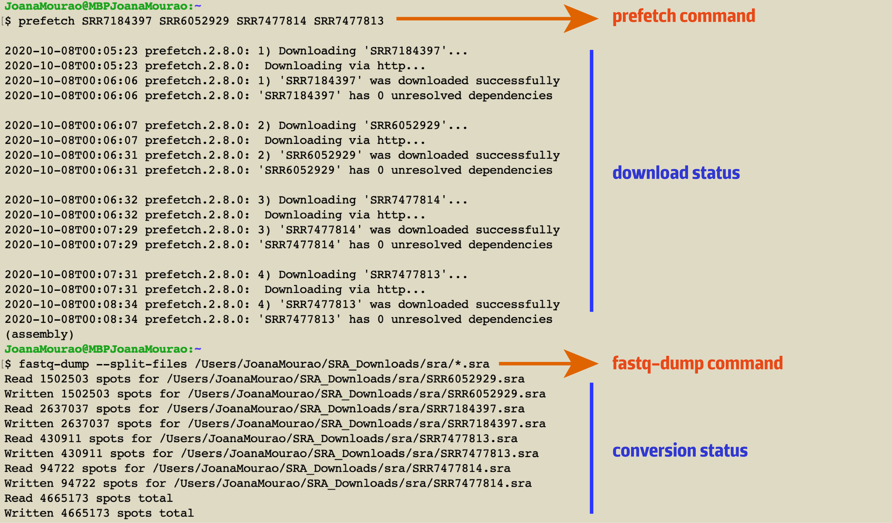
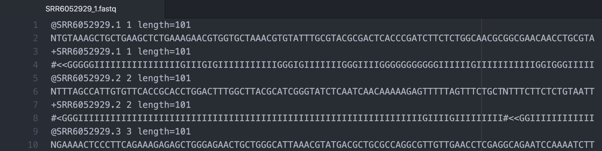
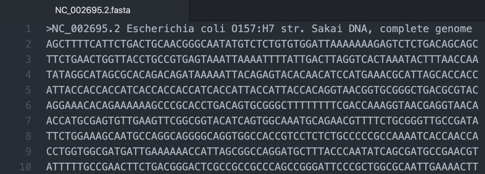
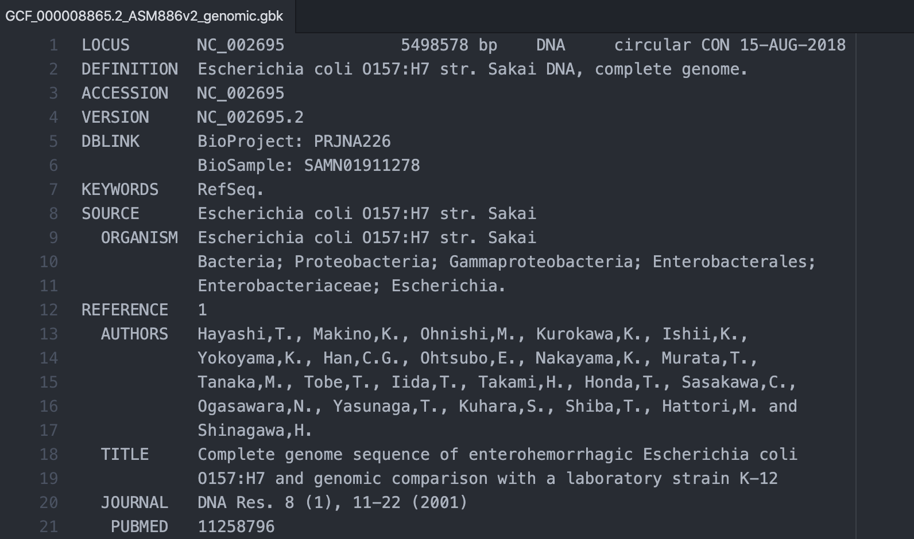

.. _ngs-data:

****************
Data acquisition
****************

Introduction
############

Bioinformaticians can work with different bacterial **multi-omics data** (e.g., genomics, proteomics, transcriptomics, metabolomics).

.. note::
   Multi-omics data can be originated from your own project or can be acquired through different databases or repositories. They are of utmost importance to store, maintain and share data [ZHULIN2015]_.

For the purpose of this Tutorial, you will explore some of these databases and acquire **two types of data**:

1. Bacterial raw sequence reads obtained from the Sequence Read Archive - |sra|
2. Completed or partially assembled reference genomes acquired from The National Center for Biotechnology Information - |ncbi|

Learning objectives
###################

After finishing this Tutorial section, you will be able to:

* Known how to acquire raw sequence reads from different sequencing platforms.
* Known how to acquire complete or partial bacterial genomes.
* Understand the type of data you are acquiring and the information that they contain.

Acquire raw sequence reads from SRA
###################################

The |sra| is a public repository that stores **raw sequence data** from next-generation sequencing technologies including **Illumina, Ion torrent, Oxford, and PacBio**.

1. You will start by acquiring Oxford Nanopore reads and a set of paired-end Illumina reads from two Shiga toxin-producing *Escherichia coli* (STEC) O157:H7 isolates [GREIG2019]_. These data will be used throughout all the Tutorial steps.

2. You can further name these two isolates, **strainA** (accession: SRR6052929-Illumina, SRR7477813-Nanopore) and **strainB** (accession: SRR7184397-Illumina, SRR7477814-Nanopore).

3. To acquire this data, you first need to install the `SRA Toolkit <https://trace.ncbi.nlm.nih.gov/Traces/sra/sra.cgi?view=toolkit_doc>`_ on our computer. The easiest way is installing SRA Tools (containing SRA Toolkit and SDK from NCBI) through |conda|. For that open the Terminal and follow these steps (the provided example is for a **Linux-based system**).

.. code-block:: bash

   # Create two new directories to store your data
   $ mkdir tutorial
   $ cd ~/tutorial
   $ mkdir raw_data

   # Create a new conda environment named "data"
   $ conda create -n data python=3.9

   # Activate your "data" environment
   $ conda activate data

   # Install SRA Tools through conda
   $ conda install -c bioconda sra-tools

   # Allow downloading raw sequence reads data from SRA using prefetch command
   $ prefetch SRR7184397 SRR6052929 SRR7477814 SRR7477813

   # Convert SRA raw sequence reads data into fastq format using fastq-dump command
   $ fastq-dump --split-files SRR7184397 SRR6052929 SRR7477814 SRR7477813

   # Move the previous acquired raw sequence reads to your new directory
   $ mv ~/reads ~/tutorial/raw_data

   # You can compress the files to take up less space in your computer
   $ gzip ~/tutorial/raw_data/*.fastq

*Figure 5. Acquisition of raw sequence reads using SRA Toolkit in a macOS.*

Acquire bacterial genome sequences from NCBI
############################################

Now that you have acquired your raw sequence reads, you will need to obtain complete or partial assembled bacterial genomes to use in comparative genomic analysis in further steps of this Tutorial.

For this, you will use the NCBI Genome Downloading Scripts developed and implemented by `Kai Blin <https://github.com/kblin>`_.

1. Let's first install `ncbi-genome-download <https://github.com/kblin/ncbi-genome-download>`_ to download bacterial genomes from NCBI and `ncbi-acc-download <https://github.com/kblin/ncbi-acc-download>`_ to download sequences from GenBank/RefSeq by accession through the NCBI.

2. Both tools will be installed in our previous created environment named ``data``.

.. code-block:: bash

    # Activate the data environment
    $ conda activate data

    # Install both ncbi-genome-download and ncbi-acc-download
    $ conda install -c bioconda ncbi-genome-download ncbi-acc-download

3. For the purpose of this tutorial you will compare the previous whole-genome assembly of *Escherichia coli* (STEC) O157:H7 with the closely related *E. coli* O157:H7 str. SAKAI reference genome already deposited in NCBI (accession number **NC002695.1** and assembly accession **GCF_000008865.2**).

Let's try both ways to acquire the data:

.. code-block:: bash

   # Retrieve the E. coli reference genome using the accession number in fasta format
   $ ncbi-acc-download --format fasta NC_002695.2

   # Retrieve the E. coli reference genome using the assembly accession in fasta format
   $ ncbi-genome-download -s refseq -F fasta -A GCF_000008865.2 bacteria

   # Retrieve the E. coli reference genome using the assembly accession in GenBank format
   $ ncbi-genome-download -s refseq -F genbank -A GCF_000008865.2 bacteria

   # Move the acquired reference genomes to the directory raw_data
   $ mv ~/genomes ~/tutorial/raw_data

   # Uncompress the GCF_000008865.2_ASM886v2_genomic files
   $ gunzip ~/tutorial/raw_data/GCF_000008865.2_ASM886v2_genomic.*.gz

.. note::
   For more information about the full usage of each one of the tools you can go to the official page of `ncbi-genome-download <https://github.com/kblin/ncbi-genome-download>`_ and `ncbi-acc-download <https://github.com/kblin/ncbi-acc-download>`_ or type in the Terminal ``ncbi-genome-download --help`` or ``ncbi-genome-download --help``.

Understanding the file content
##############################

.. note::

   * To avoid recognition problems it's recommended to put all Fasta files with the same file extension. To do this type in the Terminal ``mv ~/tutorial/raw_data/*.fa ~/tutorial/raw_data/*.fasta`` and ``mv ~/tutorial/raw_data/*.fna ~/tutorial/raw_data/*.fasta``.

   * Also let's convert ``/*.gbff`` to ``/*.gbk`` since some packages and tools are not able to recognize ``/*.gbff`` extension.

   * To do this, first install the mmv utility tool ``sudo apt-get install mmv``, after that run ``sudo mmv ~/tutorial/raw_data/*.gbff ~/tutorial/raw_data/*.gbk``.

At the end of this section, you will have a directory with **9 files** with three different file extensions (.fastq, .fasta and .gbk), that will be used along with the Tutorial. The explanation of each file is provided below.

::

    tutorial
    ├── raw_data
    │   ├── SRR6052929_1.fastq.gz
    │   ├── SRR6052929_2.fastq.gz
    │   ├── SRR7184397_1.fastq.gz
    │   ├── SRR7184397_2.fastq.gz
    │   ├── SRR7477813_1.fastq.gz
    │   ├── SRR7477814_1.fastq.gz
    │   ├── NC_002695.2.fasta
    │   ├── GCF_000008865.2_ASM886v2_genomic.fasta
    │   ├── GCF_000008865.2_ASM886v2_genomic.gbk

In the folder structure above:

* ``raw_data`` is the **directory** (or folder) that you create initially.

* ``/*.fastq.gz`` are the compressed fastq files containing the **raw** sequence reads.

* ``/*.fasta`` is the complete genome of the reference strain in **Fasta** format. A Fasta format can be represented by file extensions such as ``.fa``, ``.fna`` or ``.fasta``.

* ``/*.gbk`` is the complete genome of the reference strain in **GenBank** flat-file format. A GenBank format can be represented by file extensions such as ``.gbk``, ``.gb`` or ``.genbank``.

Compressed formats
******************

Some of the previous files that you download are in a compressed format. It allows reducing the disk space in your computer.

The most popular compressed file formats are ``.gz`` (the most common on Unix-based systems), ``.zip``, and ``.tar``.

.. todo::
   1. Try to uncompress the previous files using ``gunzip``, or ``gzip`` to compress again.

Fastq files
***********

* Fastq are standard output files used by most sequencers.

* They contain sequence information, but also its associated **quality scores**.

* Fastq files have four lines for each entry.

.. csv-table:: A Fastq format file description
   :header: "Line", "Description"
   :widths: 20, 40

   "1", "Starts with ``@`` character and a unique **identifier** for the sequence"
      , "Next to the white space a short **description** can be provided"
   "2", "The actual raw **DNA sequence** letters"
   "3", "Starts with ``+`` character and a unique **identifier** for the sequence"
      , "Next to the white space a short **description** can be provided"
   "4", "Representation of the **quality score** for each base of line 2"

* Each letter in line 4 is represented by a |phred| quality score using `ASCII <https://upload.wikimedia.org/wikipedia/commons/1/1b/ASCII-Table-wide.svg>`_ characters, assigning a probability of an incorrect base call.

* |phred| quality score (Q) is a property logarithmically related to the base-calling error probabilities (P).

* For example if |phred| assigns a quality score of 20 to a base, the chances that this base is called incorrectly are 1 in 100 (99% base call accuracy).

.. math::

   P = 10^\frac{-Q}{10} <-> P = 10^\frac{-20}{10} <-> P = 100

*Figure 6. Fastq file corresponding to the sequenced E. coli O157:H7 strains opened with Atom text editor.*

Fasta files
***********

* Fasta format files can store nucleotide or amino acid sequences and the information about their origin.

* A fasta file can contain multiple sequences each starting by ``>`` and the respective header.

.. csv-table:: A Fasta format file description
   :header: "Line", "Description"
   :widths: 20, 40

   "1", "Starts with ``>`` character and a unique **identifier** for the sequence"
      , "Next to the white space a short optional **description** of the sequence can be provided (e.g., organism)"
   "2", "The actual nucleotide or amino acid **sequence**"

*Figure 7. Fasta file corresponding to the E. coli O157:H7 str. SAKAI reference genome opened with Atom text editor.*

GenBank files
*************

The GenBank format represents in a human-readable form a lot of information that can go from the DNA sequence to gene annotation (using sequence ontology) and other types of features.

If you are interested in a detailed explanation of each represented field in a GenBank file, please go `here <https://www.ncbi.nlm.nih.gov/Sitemap/samplerecord.html>`_.

*Figure 8. GenBank file corresponding to the E. coli O157:H7 str. SAKAI reference genome opened with Atom text editor.*

.. todo::
   2. Open one example of the three file formats (``.fasta``, ``.fastq`` and ``.gbk``) with your favourite text editor such as `Atom <https://atom.io/>`_ or `Sublime <https://www.sublimetext.com/>`_ and try to identify the descriptors of each file.

References
##########

.. [ZHULIN2015] Zhulin IB. 2015. Databases for Microbiologists. J Bacteriol. 197(15):2458–2467. `DOI: 10.1128/JB.00330-15 <https://dx.doi.org/10.1128%2FJB.00330-15>`_
.. [GREIG2019] Greig DR, Jenkins C, Gharbia S, Dallman TJ. 2019. Gigascience. 8(8):giz104. `DOI: 10.1093/gigascience/giz104 <https://dx.doi.org/10.1093/gigascience/giz104>`_
