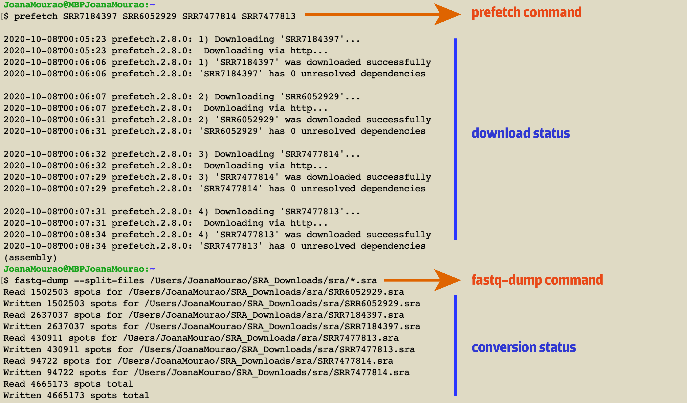
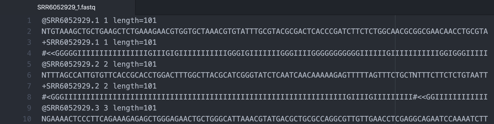
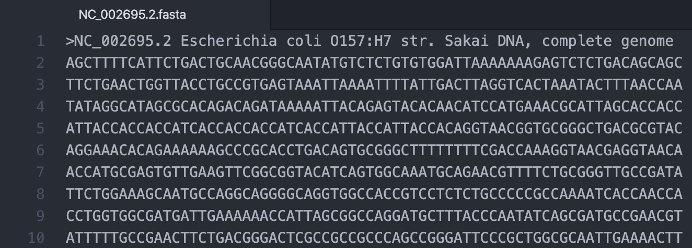
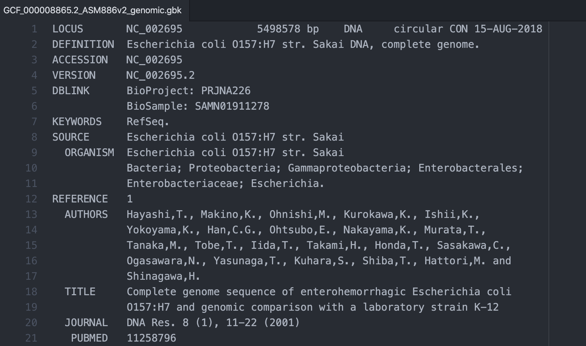

.. _ngs-data:

****************
Data acquisition
****************

Introduction
############

Bioinformaticians can work with different bacterial **multi-omics data** (e.g., genomics, proteomics, transcriptomics, metabolomics).

.. note::
   Multi-omics data can be originated from your own project or can be acquired through different databases or repositories. They are of utmost importance to store, maintain and share data [ZHULIN2015]_.

For the purpose of this Tutorial, you will explore some of these databases and acquire **two types of data**:

1. Bacterial raw sequence reads obtained from the Sequence Read Archive - |sra|
2. Completed or partially assembled reference genomes acquired from The National Center for Biotechnology Information - |ncbi|

Learning objectives
###################

After finishing this Tutorial section, you will be able to:

* Know how to acquire raw sequence reads from different sequencing platforms.
* Know how to acquire complete or partial bacterial genomes.
* Know how to organise your files and name your samples consistently, to easily analyse **several genomes** with the same commands.
* Understand the type of data you are acquiring and the information that they contain.

Acquire raw sequence reads from SRA
###################################

The |sra| is a public repository that stores **raw sequence data** from next-generation sequencing technologies including **Illumina, Ion torrent, Oxford, and PacBio**.

1. You will start by acquiring Oxford Nanopore reads and a set of paired-end Illumina reads from two Shiga toxin-producing *Escherichia coli* (STEC) O157:H7 isolates [GREIG2019]_. These data will be used throughout all the Tutorial steps.

2. You can further name these two isolates, **strainA** (accession: SRR6052929-Illumina, SRR7477813-Nanopore) and **strainB** (accession: SRR7184397-Illumina, SRR7477814-Nanopore).

3. To acquire this data, you first need to install the `SRA Toolkit <https://github.com/ncbi/sra-tools/wiki>`_ on our computer. The easiest way is installing SRA Tools (containing SRA Toolkit and SDK from NCBI) through |conda|. For that open the Terminal and follow these steps (the provided example works on **Linux and macOS**).

.. code-block:: bash

   # Create a first directory, for example in your Documents folder
   $ mkdir tutorial
   $ cd tutorial/

   # Create a second directory inside the tutorial directory to store the acquired data
   $ mkdir raw_data
   $ cd raw_data/

   # Create a new conda environment named "data" and install SRA Tools through conda
   $ conda create -n data sra-tools

   # Activate your "data" environment
   $ conda activate data

   # Allow downloading raw sequence reads data from SRA using prefetch command
   $ prefetch SRR7184397 SRR6052929 SRR7477814 SRR7477813

   # Convert SRA raw sequence reads data into fastq format using fasterq-dump command
   # Illumina (paired-end) reads will originate _1.fastq and _2.fastq files, and Nanopore reads a single .fastq file
   $ fasterq-dump --split-files --threads 4 SRR7184397 SRR6052929 SRR7477814 SRR7477813

   # Compress the files in the raw_data directory, to take up less space in your computer
   $ gzip ~/tutorial/raw_data/*.fastq

.. note::
   * ``prefetch`` and ``fasterq-dump`` create one directory per accession (e.g., ``SRR6052929/``) with the ``.sra`` file. After confirming that the ``.fastq.gz`` files were generated, you can delete them with ``rm -r SRR*/`` to save disk space (about 1.3 GB).

   * In older versions of the tutorial, ``fastq-dump --split-files`` was used. It still works but it is much slower than ``fasterq-dump`` and the Nanopore file is named ``SRR7477813_1.fastq``.

   * You can check that the files are complete by counting the reads (``gunzip -c file.fastq.gz | wc -l``, divided by 4) or with ``vdb-validate SRR6052929``.

*Figure 5. Acquisition of raw sequence reads using SRA Toolkit in a macOS.*

To avoid confusion and to make it easier to run the same commands in **several samples**, rename the files using the sample name instead of the SRA accession number. From now on, the tutorial will always use this naming convention: ``<sample>_R1.fastq.gz`` and ``<sample>_R2.fastq.gz`` for the paired-end Illumina reads, and ``<sample>_nanopore.fastq.gz`` for the Nanopore reads.

.. code-block:: bash

   $ cd ~/tutorial/raw_data/

   # strainA
   $ mv SRR6052929_1.fastq.gz strainA_R1.fastq.gz
   $ mv SRR6052929_2.fastq.gz strainA_R2.fastq.gz
   $ mv SRR7477813.fastq.gz strainA_nanopore.fastq.gz

   # strainB
   $ mv SRR7184397_1.fastq.gz strainB_R1.fastq.gz
   $ mv SRR7184397_2.fastq.gz strainB_R2.fastq.gz
   $ mv SRR7477814.fastq.gz strainB_nanopore.fastq.gz

   # Create a text file with the list of samples, one per line, that you will use to run loops
   $ printf "strainA\nstrainB\n" > ~/tutorial/samples.txt

.. hint::
   If you have many samples, you do not need to type the name of each file. You can read a table with the correspondence between the SRA accession and the sample name, and rename them in a loop.

   .. code-block:: bash

      # Create the table (tab-separated): sample, Illumina accession, Nanopore accession
      $ printf "strainA\tSRR6052929\tSRR7477813\nstrainB\tSRR7184397\tSRR7477814\n" > ~/tutorial/accessions.tsv

      # Rename all files using the table
      $ while IFS=$'\t' read -r sample illumina nanopore; do
      >    mv ${illumina}_1.fastq.gz ${sample}_R1.fastq.gz
      >    mv ${illumina}_2.fastq.gz ${sample}_R2.fastq.gz
      >    mv ${nanopore}.fastq.gz ${sample}_nanopore.fastq.gz
      > done < ~/tutorial/accessions.tsv

   The same table can also be used to download all the accessions at once: ``cut -f 2,3 accessions.tsv | tr '\t' '\n' | xargs prefetch``.

Acquire bacterial assembled genomes from NCBI
#############################################

For this tutorial, you will compare the previous whole-genome assembly of *Escherichia coli* (STEC) O157:H7 (strainA and strainB) with the closely related *E. coli* O157:H7 str. SAKAI reference genome.

We can download the genome of *E. coli* O157:H7 str. SAKAI deposited in NCBI (chromosome accession number **NC_002695.2** and assembly accession **GCF_000008865.2**) using the two tools described below.

.. note::
   The accession ``NC_002695.2`` corresponds only to the **chromosome** (~5.5 Mb) of Sakai, while the assembly ``GCF_000008865.2`` contains the chromosome **and its two plasmids** (pO157 and pOSAK1; ~5.6 Mb in total). Keep this in mind, since the plasmids will be important in the last sections of this Tutorial.

You will use the NCBI Genome Downloading Scripts developed and implemented by `Kai Blin <https://github.com/kblin>`_.

1. Let's first install `ncbi-genome-download <https://github.com/kblin/ncbi-genome-download>`_ to download bacterial genomes and `ncbi-acc-download <https://github.com/kblin/ncbi-acc-download>`_ to download GenBank/RefSeq sequences from NCBI.

2. Both tools will be installed in our previous created environment named ``data``.

.. code-block:: bash

    # Activate the data environment
    $ conda activate data

    # Install both ncbi-genome-download and ncbi-acc-download
    $ conda install ncbi-genome-download ncbi-acc-download

Let's try both ways to acquire the data:

.. code-block:: bash

   # Make sure that you are in the raw_data directory
   $ cd ~/tutorial/raw_data

   # Retrieve the E. coli reference chromosome using the accession number in fasta format
   $ ncbi-acc-download --format fasta NC_002695.2

   # Retrieve the E. coli reference chromosome annotation using the accession number in gff3 format
   $ ncbi-acc-download --format gff3 NC_002695.2

   # Retrieve the E. coli reference genome using the assembly accession in fasta format
   $ ncbi-genome-download -s refseq -F fasta -A GCF_000008865.2 bacteria

   # Retrieve the E. coli reference genome using the assembly accession in GenBank format
   $ ncbi-genome-download -s refseq -F genbank -A GCF_000008865.2 bacteria

   # Uncompress the GCF_000008865.2_ASM886v2_genomic files
   $ gunzip ~/tutorial/raw_data/refseq/bacteria/GCF_000008865.2/GCF_000008865.2_ASM886v2_genomic.*.gz

   # Move the uncompressed files to the raw_data directory
   $ mv ~/tutorial/raw_data/refseq/bacteria/GCF_000008865.2/GCF_000008865.2_ASM886v2_genomic.* ~/tutorial/raw_data

   # Remove the empty directory created by ncbi-genome-download
   $ rm -r ~/tutorial/raw_data/refseq

.. note::
   For more information about the full usage of each one of the tools you can go to the official page of `ncbi-genome-download <https://github.com/kblin/ncbi-genome-download>`_ and `ncbi-acc-download <https://github.com/kblin/ncbi-acc-download>`_ or type in the Terminal ``ncbi-genome-download --help`` or ``ncbi-acc-download --help``.

Acquire several public genomes at once
**************************************

In the last sections of the Tutorial, you will run the same analysis in **several genomes** to compare them. Besides your own strains (strainA and strainB), you will use three more complete public genomes of different *E. coli* and *Salmonella* strains, which will serve as positive and negative controls in the antimicrobial resistance and plasmid sections:

.. csv-table:: Public genomes used as examples in this Tutorial
   :header: "Name", "Assembly accession", "Organism", "Why do we use it?"
   :widths: 10, 20, 30, 40

   "Sakai", "GCF_000008865.2", "*E. coli* O157:H7 str. Sakai", "Reference of the Tutorial strains; 1 chromosome and 2 plasmids (pO157 and pOSAK1)"
   "EC958", "GCF_000285655.3", "*E. coli* O25b:H4-ST131 EC958", "Multidrug-resistant strain with an ESBL (CTX-M-15) plasmid"
   "K12", "GCF_000005845.2", "*E. coli* K-12 MG1655", "Laboratory strain without plasmids and acquired resistance genes (negative control)"
   "LT2", "GCF_000006945.2", "*Salmonella enterica* Typhimurium LT2", "Different species; carries the virulence plasmid pSLT"

.. code-block:: bash

   # Create a directory to keep all the genomes that you will analyse
   $ mkdir -p ~/tutorial/genomes
   $ cd ~/tutorial

   # Create a tab-separated table with the name and the assembly accession of each genome
   $ printf "Sakai\tGCF_000008865.2\nEC958\tGCF_000285655.3\nK12\tGCF_000005845.2\nLT2\tGCF_000006945.2\n" > public_genomes.tsv

   # Download all the genomes in a single command
   # paste -sd, joins the accession numbers (2nd column) in a comma-separated list
   $ conda activate data
   $ ncbi-genome-download -s refseq -F fasta -A $(cut -f 2 public_genomes.tsv | paste -sd, -) -o public_genomes bacteria

   # Uncompress each genome and save it with its name (loop)
   $ while IFS=$'\t' read -r name accession; do
   >    gunzip -c public_genomes/refseq/bacteria/${accession}/*_genomic.fna.gz > genomes/${name}.fasta
   > done < public_genomes.tsv

   # Check how many sequences (chromosomes and plasmids) each genome has
   $ grep -c '>' genomes/*.fasta

.. todo::
   1. Which genomes have plasmids? How many sequences does each ``.fasta`` have? Look at the headers (``grep '>' genomes/*.fasta``).
   2. Which is the size (in bp) of each genome? You can calculate it with ``grep -v '>' file.fasta | tr -d '\n' | wc -c``.

Understanding the file content
##############################

.. note::

   * It is recommended to put all Fasta and GenBank files with the same file extension to avoid recognition problems.

   * To do this type in the Terminal (inside the ``raw_data`` directory):

   .. code-block:: bash

      $ for file in *.fa; do mv "$file" "${file%.fa}.fasta"; done
      $ for file in *.fna; do mv "$file" "${file%.fna}.fasta"; done
      $ for file in *.gbff; do mv "$file" "${file%.gbff}.gbk"; done

At the end of this section, you will have a directory with **10 files** with four different file extensions (.fastq.gz, .fasta, .gff and .gbk), that will be used along with the Tutorial, and a directory with the public genomes. The explanation of each file is provided below.

::

    tutorial
    ├── samples.txt
    ├── public_genomes.tsv
    ├── raw_data
    │   ├── strainA_R1.fastq.gz
    │   ├── strainA_R2.fastq.gz
    │   ├── strainA_nanopore.fastq.gz
    │   ├── strainB_R1.fastq.gz
    │   ├── strainB_R2.fastq.gz
    │   ├── strainB_nanopore.fastq.gz
    │   ├── NC_002695.2.fasta
    │   ├── NC_002695.2.gff
    │   ├── GCF_000008865.2_ASM886v2_genomic.fasta
    │   ├── GCF_000008865.2_ASM886v2_genomic.gbk
    ├── genomes
    │   ├── Sakai.fasta
    │   ├── EC958.fasta
    │   ├── K12.fasta
    │   ├── LT2.fasta

In the folder structure above:

* ``raw_data`` is the **directory** (or folder) that you created initially.

* ``/*.fastq.gz`` are the compressed fastq files containing the **raw** sequence reads (``_R1``/``_R2``: forward/reverse Illumina reads; ``_nanopore``: Oxford Nanopore reads).

* ``samples.txt`` and ``public_genomes.tsv`` are the tables that will be used to run commands in several samples.

* ``/*.fasta`` are the genomes of the reference strain in **Fasta** format. A Fasta format can be represented by file extensions such as ``.fa``, ``.fna`` or ``.fasta``.

* ``/*.gff`` is the annotation of the reference chromosome in **GFF3** format.

* ``/*.gbk`` is the complete genome of the reference strain in **GenBank** flat-file format. A GenBank format can be represented by file extensions such as ``.gbk``, ``.gb`` or ``.genbank``.

Compressed formats
******************

Some of the previous files that you download are in a compressed format. It allows reducing the disk space in your computer.

The most popular compressed file formats are ``.gz`` (the most common on Unix-based systems), ``.zip``, and ``.tar``.

.. todo::
   3. Try to uncompress the previous files using ``gunzip``, or ``gzip`` to compress again.

Fastq files
***********

* Fastq are standard output files used by most sequencers.

* They contain sequence information, but also its associated **quality scores**.

* Fastq files have four lines for each entry.

.. csv-table:: A Fastq format file description
   :header: "Line", "Description"
   :widths: 20, 40

   "1", "Starts with ``@`` character and a unique **identifier** for the sequence"
      , "Next to the white space a short **description** can be provided"
   "2", "The actual raw **DNA sequence** letters"
   "3", "Starts with ``+`` character and a unique **identifier** for the sequence"
      , "Next to the white space a short **description** can be provided"
   "4", "Representation of the **quality score** for each base of line 2"

* Each letter in line 4 is represented by a |phred| quality score using `ASCII <https://upload.wikimedia.org/wikipedia/commons/1/1b/ASCII-Table-wide.svg>`_ characters, assigning a probability of an incorrect base call.

* |phred| quality score (Q) is a property logarithmically related to the base-calling error probabilities (P).

* For example if |phred| assigns a quality score of 20 to a base, the chances that this base is called incorrectly are 1 in 100 (99% base call accuracy).

.. math::

   P = 10^\frac{-Q}{10} \rightarrow P = 10^\frac{-20}{10} = 10^{-2} = 0.01 = \frac{1}{100}

*Figure 6. Fastq file corresponding to the sequenced E. coli O157:H7 strains opened with a text editor.*

Fasta files
***********

* Fasta format files can store nucleotide or amino acid sequences and the information about their origin.

* A fasta file can contain multiple sequences each starting by ``>`` and the respective header.

.. csv-table:: A Fasta format file description
   :header: "Line", "Description"
   :widths: 20, 40

   "1", "Starts with ``>`` character and a unique **identifier** for the sequence"
      , "Next to the white space a short optional **description** of the sequence can be provided (e.g., organism)"
   "2", "The actual nucleotide or amino acid **sequence**"

*Figure 7. Fasta file corresponding to the E. coli O157:H7 str. SAKAI reference genome opened with a text editor.*

GenBank files
*************

The GenBank format represents in a human-readable form a lot of information that can go from the DNA sequence to gene annotation (using sequence ontology) and other types of features.

If you are interested in a detailed explanation of each represented field in a GenBank file, please go `here <https://www.ncbi.nlm.nih.gov/Sitemap/samplerecord.html>`_.

*Figure 8. GenBank file corresponding to the E. coli O157:H7 str. SAKAI reference genome opened with a text editor.*

.. todo::
   4. Open one example of the three file formats (``.fasta``, ``.fastq`` and ``.gbk``) with your favourite text editor such as `Visual Studio Code <https://code.visualstudio.com/>`_ or `Sublime <https://www.sublimetext.com/>`_ and try to identify the descriptors of each file.

References
##########

.. [GREIG2019] Greig DR, Jenkins C, Gharbia S, Dallman TJ. 2019. Gigascience. 8(8):giz104. `DOI: 10.1093/gigascience/giz104 <https://dx.doi.org/10.1093/gigascience/giz104>`_
.. [ZHULIN2015] Zhulin IB. 2015. Databases for Microbiologists. J Bacteriol. 197(15):2458–2467. `DOI: 10.1128/JB.00330-15 <https://dx.doi.org/10.1128%2FJB.00330-15>`_
