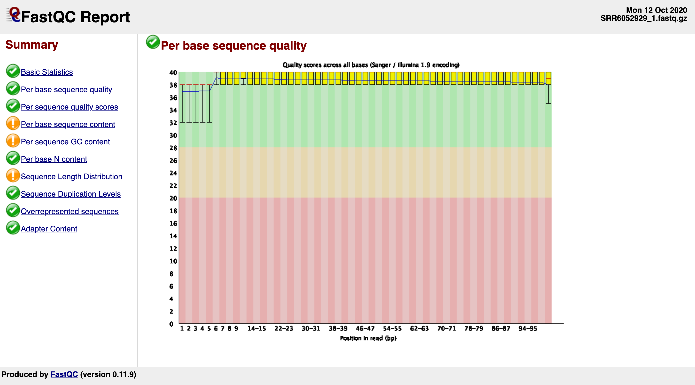
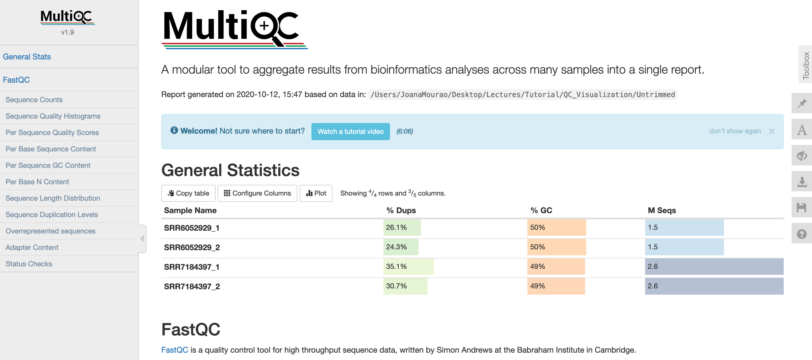

.. _ngs-qc:

***************
Quality control
***************

Introduction
############

1. We know that none of the described sequencing technologies is perfect; thus, they will generate different **types** and **amounts** of **errors**.

2. It this, therefore of utmost importance to **identify** the errors that may influence further data analysis and interpretation.

3. In this section, you will first learn how to visualize the quality of the data using |fastqc| and |multiqc|.

4. After that, we will **trim** and **filter** low quality or uninformative reads/bases through |bbduk|.

5. You will be working only with the paired-end raw data acquired through the **Illumina HiSeq 2500** Platform [GREIG2019]_.

Learning objectives
###################

After finishing this Tutorial section, you will be able to:

* Calculate the sequencing coverage.
* Generate a full combined quality report.
* Assess and interpret the general quality of raw reads.
* Improve the quality of raw reads by trimming, masking and filtering.

Coverage
########

1. As you already saw in the theoretical classes, a sequencing platform needs to sequence every base in a given sample several times.

2. The number of ``x`` times a genome has been sequenced (depth of sequencing) is expressed by a **coverage metric**.

3. There are not recommendations for ideal sequencing coverage. Most researchers determine the necessary coverage based on the type of study and available literature.

4. Ideal coverage for a genome assembly should be **50x or above** [ALBERT2019]_. It means that each base on average is sequenced 50 times.

.. hint::
   The coverage can be calculated using the following equations.

   **A. For an instrument with fixed read length:**

   ``C = LN / G``

   C: Coverage

   L: is the read length in bp (e.g. 2x100 paired-end = 200)

   N: is the number of sequenced reads

   G: is the haploid genome length in bp

   **B. For an instrument with variable read length:**

   ``C = SUM(Li) / G``

   C: Coverage

   Li: is the length of read *i* in bp

   G: is the haploid genome length in bp

Let's try to do some basic analysis and calculate the coverage using the **paired-end Illumina raw reads** (files SRR6052929 and SRR7184397).

.. todo::
   1. Open the file with the command line or with the text editor to get an idea about the structure.
   2. What is the unique identifier of the FastQC files?
   3. How many raw sequence reads are in the files?
   4. Calculate the coverage, assuming a genome size of ~5.5 MB.

Visualisation of data quality
#############################

1. The first step after receiving the sequencing data is to perform some simple quality control evaluations.

2. This step will be important to ensure that your raw data looks good and there are no problems or biases.

2. For that, you’ll first use two programs called |fastqc| and |multiqc|, to visualize the quality of the raw reads.

FastQC
******

* We already saw in section 2.5.3 that to each base is assigned a |phred| quality score.

* In this section, we will see how to visualize all these scores collectively using |fastqc|.

* Also, |fastqc| will allow you to:

  1. Create user-friendly **plots** and **tables** to assess the general quality and composition of raw sequence data.
  2. Identify any **problems** originated either in the sequencer or in the starting library material.
  3. Export the results to an **HTML** based reports.

.. note::
   Don't forget that fastq errors are not entirely accurate measures, hence use them as **warnings** for further analysis.

Installation
............

.. code-block:: bash

    # Create a new conda environment named qc
    $ conda create -n qc python=3.8

    # Activate the new environment
    $ conda activate qc

    # Install FastQC as a command-line utility
    $ conda install -c bioconda fastqc

    # Check if FastQC is installed
    $ fastqc --version

Usage
.....

**1. Input/Output files**

``Input``: Accept compress or uncompress Illumina files such as ``.fastq`` or ``.fastq.gz``. For this part of the Tutorial, we will use the paired-end Illumina raw reads.

``Output``: Two files are produced, a ``.zip`` archive containing all the plots, and a ``.html`` report. You can open the HTML files with your web browser.

**2. Basic commands**

.. code-block:: bash

    # Let's first create three new directories to keep your reports
    $ cd ~/tutorial/
    $ mkdir qc_visualisation
    $ cd qc_visualisation/
    $ mkdir trimmed untrimmed
    $ cd

    # Run FastQC on multiple fastqc.gz files
    # Specify the directory where your Illumina fastq.gz files are located
    $ fastqc -t 4 ~/tutorial/raw_data/*.fastq.gz -o ~/tutorial/qc_visualisation/untrimmed/

.. csv-table:: Parameters explanation when using FastQC
   :header: "Parameter", "Description"
   :widths: 20, 60

   "``-t NUM``", "Specifies the number of files which can be processed simultaneously (1 thread = 250 Mb memory)"
   "``-o NAME``", "Create all output files in the specified and already created output directory"
   "``--memory NUM``", "Sets the base amount of memory, in Megabytes, used to process each file (default: 512 Mb)"
   "``--nano``", "Files come from nanopore sequences and are in fast5 format"
   "``-q``", "Suppress all progress messages on stdout and only report errors"
   "``*.fastq.gz``", "Full path to paired-end Illumina raw sequence reads"

.. code-block:: bash

    # See the files that FastQC created
    $ cd ~/tutorial/qc_visualisation/untrimmed/
    $ ls

    # Open FastQC html report in Ubuntu/WSL
    $ sensible-browser <filename>_fastqc.html
    $ cd

    # Or open FastQC html report in macOS
    $ open <filename>_fastqc.html
    $ cd

**3. Additional options**

.. code-block:: bash

    # To see all the parameters available on FastQC
    $ fastqc --help

.. todo::
   5. Run |fastqc| on all the downloaded paired-end Illumina raw reads and save a copy of the report in your computer.
   6. Explore the Fastqc `website <http://www.bioinformatics.babraham.ac.uk/projects/fastqc/Help/3%20Analysis%20Modules/>`_ and try to interpret your results according to the various quality modules.
      Pay special attention to the **Basic Statistics**, **Per base Sequence Quality** and **Sequence Length Distribution**.
   7. Do your sequences have any kind of adapters?
   8. Do you think these Illumina sequencing runs gave good quality sequences? Why?
   9. Based on the FastQC report, do you think your data will need further trimming and filtering? Why?

*Figure 9. Example of a FastQC report using paired-end Illumina raw reads on a macOS.*

MultiQC
*******

The |multiqc| tool is designed to combine different quality reports, such as the ones produced by |fastqc| into a single one, thus allowing multiple comparisons at the same time.

Installation
............

.. code-block:: bash

    # Deactivate all current environments
    $ conda deactivate

    # Create a new conda environment named multiqc
    $ conda create -n multiqc python=3.8

    # Activate the new environment
    $ conda activate multiqc

    # Install MultiQC with conda
    $ conda install -c bioconda multiqc

    # Check if MultiQC is installed
    # If installed you will see "multiqc, version 1.13"
    $ multiqc --version

Usage
.....

**1. Input/Output files**

``Input``: In this tutorial you will use the ``fastqc.*`` quality visualisation reports.

``Output``: The MultiQC will generate an ``.html`` file containing the full report and a folder that contains easily machine readable data analysis.

**2. Basic commands**

.. code-block:: bash

    # Run MultiQC to combine the reports of all FastQC runs
    # Specify the directory where your FastQC reports are located
    $ multiqc ~/tutorial/qc_visualisation/untrimmed/*fastqc* -o ~/tutorial/qc_visualisation/untrimmed/

.. csv-table:: Parameters explanation when using MultiQC
   :header: "Parameter", "Description"
   :widths: 20, 60

   "``-o NAME``", "Create report in the specified and already created output directory"
   "``-q``", "Only show log warnings"
   "``*fastqc*``", "Full path to the FastQC quality visualisation reports"

.. code-block:: bash

    # Navigate to the directory containing the MultiQC .html report
    $ cd ~/tutorial/qc_visualisation/untrimmed/

    # Open MultiQC html report in Ubuntu/WSL
    $ sensible-browser multiqc_report.html
    $ cd

    # Or open MultiQC html report in macOS
    $ open multiqc_report.html
    $ cd

**3. Additional options**

.. code-block:: bash

   # To see all the parameters available on MultiQC
   $ multiqc --help

.. todo::
   10. Run |multiqc| on all the reports generated by FastQC.
   11. What are the paired-end Illumina raw reads that present the best quality? Why?

*Figure 10. Example of a MultiQC report using a combination of FastQC reports.*

Quality control
###############

1. In the previous section, we have **evaluated** and **visualised** the quality of our raw sequence reads using |fastqc|.

2. Now you have to decide if your data should be subject to **Quality Control (QC)**, i.e. the process of improving data by removing identifiable errors from it.

3. You must remember that by performing QC we can also introduce **errors** (we want the same data but with better quality); thus, we should not perform QC if the quality appears to be satisfactory.

.. attention::
   Only perform QC if your data need it. Whether you should quality-trim, and what the threshold should be, depends on your **data quality** and their **intended use**. Often a threshold of **~10** is pretty good for most of the cases.

BBDuk
*****

If your data needs QC you can use |bbduk| to trim adapters and filter other low-quality data. |bbduk| can run in trimming mode or filtering mode.

Installation
............

.. warning::

   * To run |bbtools|, you need to have **Java 7** or higher installed on the computer.

   * You can install Java through conda ``conda install -c anaconda java-1.7.0-openjdk-cos6-x86_64``.

.. code-block:: bash

    # Deactivate all current environments
    $ conda deactivate

    # Let's first create a new directory to keep the clean raw sequence reads
    $ cd ~/tutorial/
    $ mkdir qc_improvement
    $ cd

    # Download the latest version of BBTools from Sourceforge to your computer
    $ wget https://sourceforge.net/projects/bbmap/files/latest/download/BBMap_38.98.tar.gz

    # Go to the parent directory where you have BBTools file
    $ cd <installation path parent directory>

    # Extract the file contents to your installation folder on the computer
    $ tar -xvzf BBMap_(version).tar.gz

    # To test the installation run stats.sh against the PhiX reference genome located in ~/bbmap/resources
    # At the end you should see some statistics in your shell
    $ ~/bbmap/stats.sh in=(installation directory)/resources/phix174_ill.ref.fa.gz

Usage
.....

**1. Input/Output files**

``Input``: You will use the Illumina raw sequence data contained in the ``.fastq`` files.

``Output``: BBDuk will generate ``.fastq`` files containing your sequence data trimmed and filtered according to the input parameters.

**2. Basic commands**

.. note::

   * When you have the **paired-end reads** in 2 files you should **always processed them together**, not one at a time.

   * In the commands provided below don't forget to add the full path of your ``fastq.gz`` files.

.. code-block:: bash

    # Go to the directory where you want to keep the trimmed data
    $ cd ~/tutorial/qc_improvement/

    # Trim adapters when present in the raw sequence reads
    # For this example we will use a fasta file containing all adapters (adapters.fasta) that should be located in ~/bbmap/resources
    $ ~/bbmap/bbduk.sh -Xmx1g in1=read1.fastq.gz in2=read2.fastq.gz out1=clean1.fastq out2=clean2.fastq ref=adapters.fasta ktrim=r k=23 mink=11 hdist=1 tpe tbo

    # Trim regions with an average quality below 10
    $ ~/bbmap/bbduk.sh -Xmx1g in1=read1.fastq.gz in2=read2.fastq.gz out1=clean1.fastq out2=clean2.fastq qtrim=rl trimq=10

    # Discard raw sequence reads with average quality below 10
    $ ~/bbmap/bbduk.sh -Xmx1g in1=read1.fastq.gz in2=read2.fastq.gz out1=clean1.fastq out2=clean2.fastq maq=10

    # Trim regions with an average quality below 10 and discard reads with average quality below 5 after trimming
    $ ~/bbmap/bbduk.sh -Xmx1g in1=read1.fastq.gz in2=read2.fastq.gz out1=clean1.fastq out2=clean2.fastq trimq=10 maq=5

    # Optionally you can also evaluate all raw reads length and display basic statistics
    $ ~/bbmap/readlength.sh in=reads.fastq.gz out=histogram.txt

.. csv-table:: Parameters explanation when using BBDuk
   :header: "Parameter", "Description"
   :widths: 20, 60

   "``hdist``", "Hamming distance (e.g., hdist=1, this allows one mismatch)"
   "``ktrim=r``", "Once a reference kmer is matched in a read, that kmer and all the bases to the right will be trimmed (3' adapters)"
   "``ktrim=l``", "Once a reference kmer is matched in a read, that kmer and all the bases to the left will be trimmed (5' adapters)"
   "``ktrim=N``", "Rather than trimming, it masks all bases covered by reference kmers to *N*"
   "``k``", "Kmer size to use. It can have a length between 1-31. Usually the longer a kmer, the greater the specificity"
   "``maq``", "Discard reads with average quality below a specified value (e.g., maq=10, means average quality BELOW 10)"
   "``mink``", "Allows to use shorter kmers at the ends of the read (e.g., k=11 for the last 11 bases)"
   "``out``", "Catch reads that don't match a reference kmers"
   "``outm``", "Catch reads that match a reference kmers"
   "``qtrim=rl``", "It will trim the left and right sides"
   "``qtrim=l``", "It will trim the left side"
   "``qtrim=r``", "It will trim the right side"
   "``ref=file.fa``", "Fasta file containing adapters sequence or other contamination"
   "``stats``", "Produce a report with the contaminant sequences and how many reads of them were seen"
   "``tbo``", "Also trim adapters based on pair overlap detection using BBMerge"
   "``tpe``", "Trim both reads to the same length"
   "``trimq``", "Quality-trim using the Phred algorithm (e.g., trimq=10, it will trimm regions with an average quality BELOW 10)"
   "``-Xmx1g``", "It forces BBDuk to use 1 GB of memory"
   "``minlength=10``", "Reads shorter than this after trimming will be discarded"

**3. Additional options**

.. code-block:: bash

   # To see all the parameters available on BBDuk
   $ ~/bbmap/bbduk.sh --help

.. todo::
   12. Run |bbduk| on all the downloaded raw paired-end Illumina reads if needed.
   13. Run |fastqc| in the trimmed files.
   14. Aggregate all the reports of trimmed and untrimmed files with |multiqc|.
   15. Did you noticed any kind of improvement in quality after the trimming and filtering process? Which parameters are now better?
   16. Move all the quality visualisation files produced by |fastqc| and |multiqc| to the directory ``~/tutorial/qc_visualisation/trimmed``.

.. hint::
   If you want to use less disk space in your computer, you can compress all the previous ``.fastq`` files by using the ``gzip`` command.

Folder structure
################

At the end of this section, you will have the following folder structure.

::

    tutorial
    ├── raw_data
    │   ├── files_fastq.gz
    │   ├── files.fasta
    │   ├── files.gbk
    ├── qc_visualisation
    │   ├── trimmed
    │   │   ├── files_clean_fastqc.html
    │   │   ├── files_clean_fastqc.zip
    │   │   ├── multiqc_clean_report.html
    │   │   ├── multiqc_clean_data
    │   ├── untrimmed
    │   │   ├── files_fastqc.html
    │   │   ├── files_fastqc.zip
    │   │   ├── multiqc_report.html
    │   │   ├── multiqc_data
    ├── qc_improvement
    │   ├── files_clean.fastq.gz

References
##########

.. [ALBERT2019] Albert I. 2019. The Biostar Handbook. 2nd Edition. `<https://www.biostarhandbook.com/>`_

List of QC tools
################

.. seealso::

   * The tools used in this Tutorial section are not the only ones available for the purpose of quality control.

   * Other tools can also be used to perform this task (**some examples are provided in table below**).

.. csv-table::
   Table with other available Software installed by conda.
   :header: "Package name", "Version", "Main objective"
   :widths: 20, 20, 40

   "`BBTools <https://jgi.doe.gov/data-and-tools/software-tools/bbtools/>`_", "37.62", "Quality control tools (contains BBMap, BBDuk)"
   "`Cutadapt <https://cutadapt.readthedocs.io/en/stable/>`_", "4.1", "Quality control tool"
   "`FastQC <http://www.bioinformatics.babraham.ac.uk/projects/fastqc/>`_", "0.11.9", "Quality control visualisation"
   "`MultiQC <https://multiqc.info/>`_", "1.13", "Quality control visualisation"
   "`PRINSEQ <http://prinseq.sourceforge.net>`_", "0.20.4", "Quality control visualisation and improvement"
   "`Trimmomatic <http://www.usadellab.org/cms/?page=trimmomatic>`_", "0.36", "Quality control tool"
   "`Trim Galore <http://www.bioinformatics.babraham.ac.uk/projects/trim_galore/>`_", "0.6.2", "Quality control tool"
   "`NanoPlot <https://github.com/wdecoster/NanoPlot>`_", "1.20.0", "Quality control visualisation for for Oxford Nanopore reads"
   "`Porechop <https://github.com/rrwick/Porechop>`_", "0.2.4", "Quality control improvement for Oxford Nanopore reads"
   "`Nanofilt <https://github.com/wdecoster/nanofilt>`_", "2.3.0", "Quality control visualisation and improvement for Oxford Nanopore reads"
