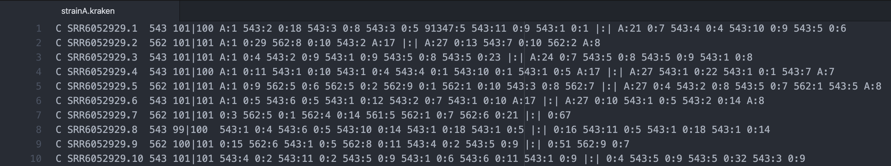
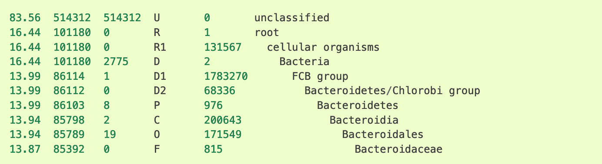
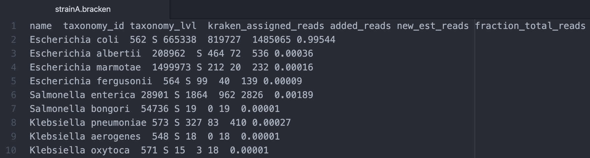
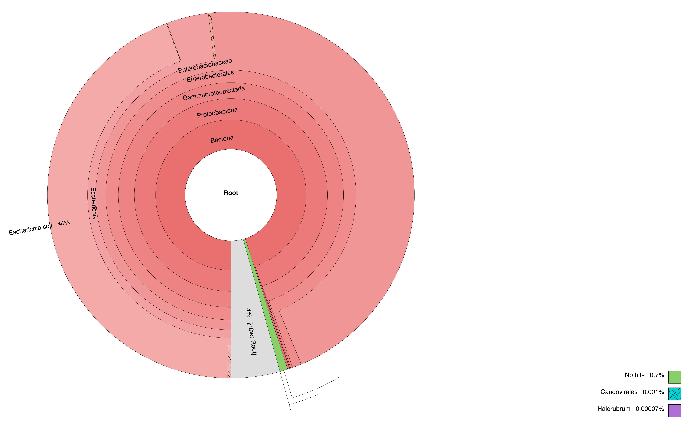

.. _ngs-taxonomy:

********
Taxonomy
********

Introduction
############

1. Taxonomy has the objective of naming, describing and classifying organisms based on shared characteristics [ALBERT2019]_.

2. To simplify the process of comparison, we usually use the `NCBI taxonomy <https://www.ncbi.nlm.nih.gov/taxonomy>`_.

3. In this section, we will use |kraken| for taxonomic classification of our sequenced samples and input these results to |bracken| for estimation of species-level or genus-level abundances.

4. Finally, we will use |krona| to generate interactive plots of the previous taxonomic labels.

Learning objectives
###################

After finishing this Tutorial section, you will be able to:

* Perform a complete taxonomic classification of raw sequence data.
* Estimate the abundance of species or genera using the taxonomy labels.
* Visualise and interpret taxonomic classification in samples.

Taxonomy assignment
###################

Kraken2 and Bracken
*******************

* |kraken| is a taxonomic classification system that uses k-mer matches to find the lowest common ancestor (LCA) of all genomes containing the given k-mer [WOOD2019]_.

* Contrary, |bracken| is a related tool that uses the taxonomy labels in |kraken| report to additionally estimates relative abundances of species or genera [LU2017]_.

* The use of |bracken| is not mandatory although when combined with Kraken classification, it will provide more accurate species- and genus-level abundance estimations.

* Besides installing |kraken| and |bracken|, you need to download or create a **database** that will be used by both tools. To create a custom database, you will need a lot of disk space (at least 100 GB) in your computer.

* So, for the purpose of this Tutorial, we will use an already pre-built `Standard-8 <https://benlangmead.github.io/aws-indexes/k2>`_ database (maintained by Ben Langmead) that is already prepared to be used also by |bracken|. The **Standard-8** index contains RefSeq archaea, bacteria, viral, plasmid, human and UniVec_Core sequences, and is capped at 8 GB of RAM (it needs ~8 GB of free memory and ~8 GB of disk space once extracted). The older MiniKraken2 v1/v2 databases, used in previous versions of this tutorial, are no longer updated.

* A |kraken| database is a directory containing at least 3 files (when it is also prepared for |bracken|, it contains additional ``database*mers.kmer_distrib`` files):

    1. ``hash.k2d``: Contains the minimizer to taxon mappings.
    2. ``opts.k2d``: Contains information about the options used to build the database.
    3. ``taxo.k2d``: Contains taxonomy information used to build the database.

.. note::
   To use the **Standard-8** database you just need to provide in the command line the name of the directory in which you stored these three files.

Installation
............

.. code-block:: bash

    # Deactivate all current environments
    $ conda deactivate

    # Create a new environment named taxonomy and install Kraken2
    $ conda create -n taxonomy kraken2

    # Activate the taxonomy environment
    $ conda activate taxonomy

    # Check if Kraken2 is installed
    $ kraken2 --version

|bracken| is installed in different ways, depending on your operating system:

.. code-block:: bash

    # Linux: install Bracken with conda, in the same environment
    $ conda install bracken

    # Check if Bracken is installed
    $ bracken -v

.. warning::
   The recent versions of Bracken (3.x) are **not available in conda for macOS** (an old and incompatible version 1.0.0 may be installed instead). In macOS, download the Bracken source code, which already includes the Python script ``est_abundance.py`` that you will use to estimate the abundances (it does not require compilation).

   .. code-block:: bash

      $ cd ~
      $ git clone https://github.com/jenniferlu717/Bracken.git

      # Check that the script works
      $ python ~/Bracken/src/est_abundance.py --help

.. note::
   On Linux, you can also run the Bracken Python script directly (``est_abundance.py``) using the commands shown below for macOS.

**1. Input/Output files**

``Input_kraken2``: Accept compress or uncompress files such as ``.fastq`` or ``.fastq.gz``. For this part of the Tutorial, we will use the paired-end Illumina raw reads.

``Output_kraken2``: A standard tab-delimited file is produced containing the classification for each sequence. You can also obtain additional output files such a |kraken| sample report (change the output into different formats) using the ``--report`` option or the classified sequences in a single file using the ``--classified-out`` flag.

``Input_bracken``: It will use the |kraken| report file created using ``--report FILENAME``.

``Output_braken``: A tab-delimited file containing the relative abundances of species or genera.

**2. Basic commands**

.. code-block:: bash

    # Let's first create new directories to store your analysis
    $ cd ~/tutorial
    $ mkdir taxonomy
    $ cd ~/tutorial/taxonomy/
    $ mkdir kraken_bracken krona
    $ cd

    # Download the Kraken2 Standard-8 database (5.5 GB download, 7.5 GB on disk) and extract it into a new directory
    # Check the most recent version in https://benlangmead.github.io/aws-indexes/k2
    $ mkdir -p ~/databases/kraken2_standard_08
    $ cd ~/databases/kraken2_standard_08
    $ wget https://genome-idx.s3.amazonaws.com/kraken/k2_standard_08_GB_20260626.tar.gz
    $ tar -xvzf k2_standard_08_GB_20260626.tar.gz

    # Remove the compressed archive to save disk space
    $ rm k2_standard_08_GB_20260626.tar.gz

    # Check the content of the database (hash.k2d, opts.k2d, taxo.k2d, ...)
    $ ls ~/databases/kraken2_standard_08

    # Go to the directory kraken_bracken where you will store the results
    $ cd ~/tutorial/taxonomy/kraken_bracken

    # Run Kraken2 in your paired-end sequence reads
    $ kraken2 --threads 4 --db ~/databases/kraken2_standard_08 --report strainA.kreport --gzip-compressed --paired --classified-out cseqs_strainA#.fastq ~/tutorial/raw_data/strainA_R1.fastq.gz ~/tutorial/raw_data/strainA_R2.fastq.gz --output strainA.kraken2

.. csv-table:: Parameters explanation when using Kraken2
   :header: "Parameter", "Description"
   :widths: 20, 60

   "``--threads NUM``", "Number of threads (default: 1)"
   "``--db NAME``", "Full path of the Kraken2 database (default: none)"
   "``--report FILENAME``", "Print a report with aggregate counts/clade to file"
   "``--gzip-compressed``", "Input files are compressed with gzip"
   "``--paired``", "The filenames provided have paired-end reads"
   "``--classified-out FILENAME``", "Print classified sequences to filename"
   "``--output FILENAME``", "Print output to filename"
   "``--memory-mapping``", "Avoid loading the database into RAM (slower, but it allows to run with less memory)"
   "``--confidence FLOAT``", "Confidence score threshold, between 0 and 1 (default: 0.0)"
   "``--use-names``", "Print scientific names instead of taxonomy IDs in the output"
   "``strainA_R1.fastq.gz``", "Full path to paired-end Illumina raw sequence reads 1"
   "``strainA_R2.fastq.gz``", "Full path to paired-end Illumina raw sequence reads 2"

If you open the **standard Kraken2 output file** with a text editor you will see that each line represents a classified sequence.

*Figure 11. Example of a standard Kraken2 output format file.*

You will see 5 columns in this report that represents from left to right:

   1. ``C``/``U``: a one letter code indicating that the sequence was either classified or unclassified.
   2. The **sequence ID**, obtained from the FASTA/FASTQ header.
   3. The **taxonomy ID** |kraken| used to label the sequence; this is 0 if the sequence is unclassified.
   4. The **sequence length** in bp. In the case of paired read data, this will be a string containing the lengths of the two sequences in bp, separated by a pipe character, e.g. "98|94".
   5. A space-delimited list indicating the **lowest common ancestor** (in the taxonomic tree) mapping to each k-mer in the sequence(s) (e.g., ``562:13``, means that the first 13 k-mers were mapped to taxonomy ID #562).

If you open the **sample report output file** with a text editor you will see that each line represents a taxon.

*Figure 12. Example of a sample report output format file.*

From left to the right you can identify 6 columns representing:

   1. **Percentage of fragments** covered by the clade rooted at this taxon.
   2. **Number of fragments** covered by the **clade** rooted at this taxon.
   3. **Number of fragments** assigned directly to this **taxon**.
   4. A **rank code**, indicating (U)nclassified, (R)oot, (D)omain, (K)ingdom, (P)hylum, (C)lass, (O)rder, (F)amily, (G)enus, or (S)pecies.
   5. `NCBI Taxonomy <https://www.ncbi.nlm.nih.gov/taxonomy>`_ **ID** number.
   6. Indented **scientific name**.

.. code-block:: bash

    # Go to the directory kraken_bracken where you will storage the results
    $ cd ~/tutorial/taxonomy/kraken_bracken

    # Now let's run Bracken using the previous sample report from Kraken2 (Linux)
    # -r is the read length (the database must contain the file database<READ_LEN>mers.kmer_distrib)
    $ bracken -d ~/databases/kraken2_standard_08 -i strainA.kreport -o strainA.bracken -r 100 -l S

    # Or run the Bracken Python script (macOS and Linux)
    $ python ~/Bracken/src/est_abundance.py -i strainA.kreport -k ~/databases/kraken2_standard_08/database100mers.kmer_distrib -o strainA.bracken -l S

.. csv-table:: Parameters explanation when using Bracken
   :header: "Parameter", "Description"
   :widths: 20, 60

   "``-d NAME``", "Full path of the Kraken2 database"
   "``-i INPUT``", "Kraken REPORT file to use for abundance estimation"
   "``-l LEVEL``", "Level to estimate abundance at [options: D,P,C,O,F,G,S] (default: S)"
   "``-o OUTPUT``", "File name for Bracken default output"
   "``-r LENGTH``", "Read length used to build the Bracken database files (default: 100); use the one closer to your read length (e.g., 100 or 150)"
   "``-t THRESHOLD``", "Minimum number of reads that Kraken2 needs to assign to a taxon before the re-estimation (default: 0)"
   "``-k FILE``", "(est_abundance.py) Kmer distribution file of the database (``database<READ_LEN>mers.kmer_distrib``)"

If you open the **Bracken output file** with a text editor you will see that each line represents a species.

*Figure 13. Example of a Bracken output file.*

From left to the right you can identify 7 columns representing:

   1. Name.
   2. Taxonomy ID.
   3. Level ID (S=Species, G=Genus, O=Order, F=Family, P=Phylum, D=Domain).
   4. Kraken Assigned Reads.
   5. Added Reads with Abundance Reestimation.
   6. Total Reads after Abundance Reestimation.
   7. Fraction of Total Reads.

**3. Additional options**

.. code-block:: bash

    # To see a full list of available options in Kraken2
    $ kraken2 --help

    # To see a full list of available options in Bracken
    # (Bracken has no --help; running it without arguments prints the usage)
    $ bracken
    $ python ~/Bracken/src/est_abundance.py --help

**4. Running Kraken2 and Bracken in several samples**

To classify all your samples with the same parameters, use a loop over the sample names listed in ``samples.txt``. Each sample will have its own output files and log.

.. code-block:: bash

   $ cd ~/tutorial
   $ DB=~/databases/kraken2_standard_08
   $ mkdir -p logs
   $ while read -r sample; do
   >    echo "Classifying ${sample}"
   >    kraken2 --threads 4 --db $DB --gzip-compressed --paired \
   >       --report taxonomy/kraken_bracken/${sample}.kreport \
   >       --output taxonomy/kraken_bracken/${sample}.kraken2 \
   >       raw_data/${sample}_R1.fastq.gz raw_data/${sample}_R2.fastq.gz 2> logs/${sample}_kraken2.log
   >    python ~/Bracken/src/est_abundance.py -i taxonomy/kraken_bracken/${sample}.kreport \
   >       -k $DB/database100mers.kmer_distrib -o taxonomy/kraken_bracken/${sample}.bracken -l S
   > done < samples.txt

   # See the percentage of classified reads of each sample
   $ grep -H "classified" logs/*_kraken2.log

   # Print the 3 most abundant species of each sample (7th column = fraction of total reads)
   $ for file in taxonomy/kraken_bracken/*.bracken; do
   >    echo "== $(basename $file .bracken)"
   >    tail -n +2 $file | sort -t$'\t' -k7,7nr | head -n 3 | cut -f 1,6,7
   > done

.. note::
   If the ``--classified-out`` option is not used, Kraken2 does not save the classified reads, which saves a lot of disk space. Use it only if you want to extract the reads from a specific taxon.

.. todo::
   1. Run |kraken| and |bracken| on all the downloaded raw paired-end Illumina reads and save a copy of the report.

Taxonomy visualisation
######################

Krona
*****

* |krona| allows visualising the previous taxa content of your samples obtained by |kraken| [ONDOV2011]_.

* |krona| produces interactive multi-layered pie charts that can be explored with zooming and exported for publication using the snapshot tool.

* |Krona| charts can be created using an `Excel template <https://github.com/marbl/Krona/wiki/ExcelTemplate>`_ or `KronaTools <https://github.com/marbl/Krona/wiki/KronaTools>`_.

Installation
............

.. code-block:: bash

    # Activate the taxonomy environment
    $ conda activate taxonomy

    # Install Krona
    $ conda install krona

    # Build a taxonomy database for Krona (it needs the command line tools curl and make)
    $ ktUpdateTaxonomy.sh $CONDA_PREFIX/opt/krona/taxonomy

.. note::
   ``$CONDA_PREFIX`` is the directory of the active conda environment (e.g., ``~/miniforge3/envs/taxonomy``). If ``make`` is not installed, in Ubuntu/WSL use ``sudo apt-get install -y make`` and in macOS run ``xcode-select --install``.

Usage
.....

**1. Input/Output files**

``Input``: |krona| accepts created Excel Templates or Kraken output files (e.g., ``strainA.kraken2``).

``Output``: It will create interactive ``.html`` charts.

**2. Basic commands**

.. code-block:: bash

    # Run Krona using the Kraken2 output
    $ ktImportTaxonomy -q 2 -t 3 ~/tutorial/taxonomy/kraken_bracken/strainA.kraken2 -o ~/tutorial/taxonomy/krona/strainA_krona.html

    # Or run Krona using the Kraken2 report (smaller and faster; -m is the column with the number of reads, and -t the taxonomy ID)
    $ ktImportTaxonomy -m 3 -t 5 ~/tutorial/taxonomy/kraken_bracken/strainA.kreport -o ~/tutorial/taxonomy/krona/strainA_krona.html

.. csv-table:: Parameters explanation when using Krona
   :header: "Parameter", "Description"
   :widths: 20, 60

   "``-q VALUE``", "Column of the input file with the query (**sequence ID**); 2 for the Kraken2 results"
   "``-t VALUE``", "Column of the input file with the **taxonomy ID**; 3 for the Kraken2 results and 5 for the Kraken2 report"
   "``-m VALUE``", "Column of the input file with the magnitude (**number of reads**); 3 for the Kraken2 report"
   "``-o NAME``", "File name for Krona default output"

.. code-block:: bash

    # Let's go to the directory where the HTML files produced by Krona are
    $ cd ~/tutorial/taxonomy/krona/

    # Open Krona html report in Ubuntu/WSL
    $ sensible-browser <filename>_krona.html

    # Or open Krona html report in macOS
    $ open <filename>_krona.html

**3. Running Krona in several samples**

.. code-block:: bash

   $ cd ~/tutorial/taxonomy

   # One chart for each sample (loop)
   $ while read -r sample; do
   >    ktImportTaxonomy -q 2 -t 3 kraken_bracken/${sample}.kraken2 -o krona/${sample}_krona.html
   > done < ~/tutorial/samples.txt

   # A single chart to compare all the samples (a drop-down menu allows you to switch between samples)
   $ ktImportTaxonomy -q 2 -t 3 kraken_bracken/*.kraken2 -o krona/all_samples_krona.html

*Figure 14. Example of a Krona HTML report on a macOS.*

.. todo::
   2. Visualize the |kraken| results using |krona| for strainA and strainB and save the final charts to your computer.
   3. What is the primary taxonomy ID present in your samples? And the genus?
   4. Did you notice any kind of contamination in your samples? Belonging to each taxonomy ID and genus?

Folder structure
################

At the end of this section, you will have the following folder structure.

::

    tutorial
    ├── raw_data
    │   ├── <sample>_R1.fastq.gz
    │   ├── <sample>_R2.fastq.gz
    │   ├── <sample>_nanopore.fastq.gz
    │   ├── files.fasta
    │   ├── files.gff
    │   ├── files.gbk
    ├── genomes
    ├── qc_visualisation
    │   ├── trimmed
    │   │   ├── <sample>_clean_R1_fastqc.html
    │   │   ├── <sample>_clean_R1_fastqc.zip
    │   │   ├── multiqc_clean_report.html
    │   │   ├── multiqc_clean_data
    │   ├── untrimmed
    │   │   ├── <sample>_R1_fastqc.html
    │   │   ├── <sample>_R1_fastqc.zip
    │   │   ├── multiqc_report.html
    │   │   ├── multiqc_data
    ├── qc_improvement
    │   ├── <sample>_clean_R1.fastq.gz
    │   ├── <sample>_clean_R2.fastq.gz
    ├── taxonomy
    │   ├── kraken_bracken
    │   │   ├── <sample>.kraken2
    │   │   ├── <sample>.kreport
    │   │   ├── <sample>.bracken
    │   ├── krona
    │   │   ├── <sample>_krona.html
    │   │   ├── all_samples_krona.html

References
##########

.. [LU2017] Lu J, Breitwieser FP, Thielen P, Salzberg SL. 2017. Bracken: estimating species abundance in metagenomics data. PeerJ Computer Science. 3:e104. `DOI: 10.7717/peerj-cs.104 <https://dx.doi.org/10.7717/peerj-cs.104>`_.
.. [ONDOV2011] Ondov BD, Bergman NH, Phillippy AM. 2011. Interactive metagenomic visualization in a Web browser. BMC Bioinformatics. 12:385. `DOI: 10.1186/1471-2105-12-385 <https://dx.doi.org/10.1186/1471-2105-12-385>`_.
.. [WOOD2019] Wood DE, Lu J, Langmead B. 2019. Improved metagenomic analysis with Kraken 2. Genome Biol. 20:257. `DOI: 10.1186/s13059-019-1891-0 <https://dx.doi.org/10.1186%2Fs13059-019-1891-0>`_.
