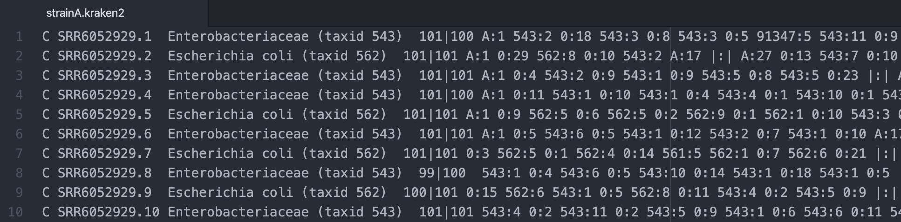
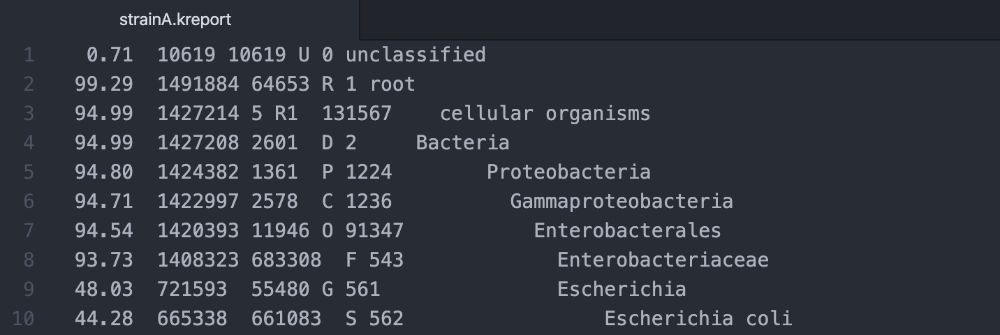

.. _ngs-taxonomy:

********
Taxonomy
********

Introduction
############

1. Taxonomy has the objective of naming, describing and classifying organisms based on shared characteristics [ALBERT2019]_.

2. To simplify the process of comparison, we usually use the `NCBI taxonomy <https://www.ncbi.nlm.nih.gov/taxonomy>`_.

3. In this section, we will use |kraken| for taxonomic classification of our sequenced samples and input these results to |bracken| for estimation of species-level or genus-level abundances.

4. Finally, we will use |krona| to generate interactive plots of the previous taxonomic labels.

Learning objectives
###################

After finishing this Tutorial section, you will be able to:

* Perform a complete taxonomic classification of raw sequence data.
* Estimate the abundance of species or genera using the taxonomy labels.
* Visualize and interpret taxonomic classification in samples.

Taxonomy assignment
###################

Kraken2 and Bracken
*******************

* |kraken| is a taxonomic classification system that uses k-mer matches to find the lowest common ancestor (LCA) of all genomes containing the given k-mer [WOOD2019]_.

* Contrary, |bracken| is a related tool that uses the taxonomy labels in |kraken| report to additionally estimates relative abundances of species or genera [LU2017]_.

* The use of |bracken| is not mandatory although when combined with Kraken classification, it will provide more accurate species- and genus-level abundance estimations.

* Besides installing |kraken| and |bracken|, you need to download or create a **database** that will be used by both tools. To create a custom database, you will need a lot of disk space (at least 100 GB) in your computer.

* So, for the purpose of this Tutorial, we will use an already pre-build standard `MiniKraken <https://benlangmead.github.io/aws-indexes/k2>`_ database that is already prepared to be used also by |bracken|. The **MiniKraken** v1 was built from RefSeq bacteria, archaea, and viral sequences.

* A |kraken| database is a directory containing at least 3 files:

    1. ``hash.k2d``: Contains the minimizer to taxon mappings.
    2. ``opts.k2d``: Contains information about the options used to build the database.
    3. ``taxo.k2d``: Contains taxonomy information used to build the database.

.. note::
   To use the **MiniKraken** database you just need to provide in the command line the name of the directory in which you stored these three files.

Installation
............

.. note::
   One of the main dependencies of |bracken| is |kraken|, so you just need to install the first, thus avoiding dependency conflicts.

.. code-block:: bash

    # Activate the qc environment
    $ conda activate qc

    # Install Bracken with conda
    $ conda install -c bioconda bracken

    # Check if all the packages are installed
    $ kraken2 --version
    $ bracken --version

Usage
.....

**1. Input/Output files**

``Input_kraken2``: Accept compress or uncompress files such as ``.fastq`` or ``.fastq.gz``. For this part of the Tutorial, we will use the paired-end Illumina raw reads.

``Output_kraken2``: A standard tab-delimited file is produced containing the classification for each sequence. You can also obtain additional output files such a |kraken| sample report (change the output into different formats) using the ``--report`` option or the classified sequences in a single file using the ``--classified-out`` flag.

``Input_bracken``: It will use the |kraken| report file created using ``--report FILENAME``.

``Output_braken``: A tab-delimited file containing the relative abundances of species or genera.

**2. Basic commands**

.. code-block:: bash

    # Let's first create new directories to store your analysis
    $ cd ~/tutorial
    $ mkdir taxonomy
    $ cd ~/tutorial/taxonomy/
    $ mkdir kraken_bracken krona
    $ cd

    # Download the MiniKraken v1 database
    $ wget ftp://ftp.ccb.jhu.edu/pub/data/kraken2_dbs/old/minikraken2_v1_8GB_201904.tgz

    # Extract the archive content to your computer
    $ tar -xvzf ~/minikraken2_v1_8GB_201904_UPDATE.tgz
    $ rm minikraken2_v1_8GB_201904_UPDATE.tgz

    # Run Kraken2 in your paired-end sequence reads
    $ kraken2 --threads 4 --db ~/minikraken2_v1_8GB/ --report strainA.kreport --gzip-compressed --paired --classified-out cseqs_strainA#.fastq ~/tutorial/raw_data/seqs_1.fastq.gz ~/tutorial/raw_data/seqs_2.fastq.gz --output strainA.kraken2

    # Move your result files to the directory kraken_bracken
    $ mv <path_results_kraken2> ~/tutorial/taxonomy/kraken_bracken/

.. csv-table:: Parameters explanation when using Kraken2
   :header: "Parameter", "Description"
   :widths: 20, 60

   "``--threads NUM``", "Number of threads (default: 1)"
   "``--db NAME``", "Full path of the Kraken2 database (default: none)"
   "``--report FILENAME``", "Print a report with aggregate counts/clade to file"
   "``--gzip-compressed``", "Input files are compressed with gzip"
   "``--paired``", "The filenames provided have paired-end reads"
   "``--classified-out FILENAME``", "Print classified sequences to filename"
   "``--output FILENAME``", "Print output to filename"
   "``seqs_1.fastq.gz``", "Full path to paired-end Illumina raw sequence reads 1"
   "``seqs_2.fastq.gz``", "Full path to paired-end Illumina raw sequence reads 2"

.. error::
   After running Kraken2 if you see this error ``Segmentation fault: 11``, probably you will not have the final report file (created using ``--report FILENAME``) needed to run |bracken|.
   If this happens, please download the final Kraken2 reports :download:`https://drive.google.com/drive/folders/11pa-h7ukHsZwgperJIAmjF7c5-XjlelO?usp=sharing`.
   This is an issue that happens mostly in macOS systems and it now being currently corrected by |kraken| developers.

If you open the **standard Kraken2 output file** with a text editor you will see that each line represents a classified sequence.

*Figure 11. Example of a standard Kraken2 output format file.*

You will see 5 columns in this report that represents from left to right:

   1. ``C``/``U``: a one letter code indicating that the sequence was either classified or unclassified.
   2. The **sequence ID**, obtained from the FASTA/FASTQ header.
   3. The **taxonomy ID** |kraken| used to label the sequence; this is 0 if the sequence is unclassified.
   4. The **sequence length** in bp. In the case of paired read data, this will be a string containing the lengths of the two sequences in bp, separated by a pipe character, e.g. "98|94".
   5. A space-delimited list indicating the **lowest common ancestor** (in the taxonomic tree) mapping to each k-mer in the sequence(s) (e.g., ``562:13``, means that the first 13 k-mers were mapped to taxonomy ID #562).

If you open the **sample report output file** with a text editor you will see that each line represents a taxon.

*Figure 12. Example of a sample report output format file.*

From left to the right you can identify 6 columns representing:

   1. **Percentage of fragments** covered by the clade rooted at this taxon.
   2. **Number of fragments** covered by the **clade** rooted at this taxon.
   3. **Number of fragments** assigned directly to this **taxon**.
   4. A **rank code**, indicating (U)nclassified, (R)oot, (D)omain, (K)ingdom, (P)hylum, (C)lass, (O)rder, (F)amily, (G)enus, or (S)pecies.
   5. `NCBI Taxonomy <https://www.ncbi.nlm.nih.gov/taxonomy>`_ **ID** number.
   6. Indented **scientific name**.

.. code-block:: bash

    # Now let's run Bracken using the previous sample report from Kraken2
    $ bracken -d ~/minikraken2_v1_8GB/ -i ~/tutorial/taxonomy/kraken_bracken/strainA.kreport -l S -o strainA.bracken

    # Move your result files to the directory kraken_bracken
    $ mv <path_results_bracken> ~/tutorial/taxonomy/kraken_bracken/

.. csv-table:: Parameters explanation when using Bracken
   :header: "Parameter", "Description"
   :widths: 20, 60

   "``-d NAME``", "Full path of the Kraken2 database"
   "``-i INPUT``", "Kraken REPORT file to use for abundance estimation"
   "``-l LEVEL``", "Level to estimate abundance at [options: D,P,C,O,F,G,S] (default: S)"
   "``-o OUTPUT``", "File name for Bracken default output"

If you open the **Bracken output file** with a text editor you will see that each line represents a species.

*Figure 13. Example of a Bracken output file.*

From left to the right you can identify 7 columns representing:

   1. Name.
   2. Taxonomy ID.
   3. Level ID (S=Species, G=Genus, O=Order, F=Family, P=Phylum, K=Kingdom).
   4. Kraken Assigned Reads.
   5. Added Reads with Abundance Reestimation.
   6. Total Reads after Abundance Reestimation.
   7. Fraction of Total Reads.

**3. Additional options**

.. code-block:: bash

    # To see a full list of available options in Kraken2
    $ kraken2 --help

    # To see a full list of available options in Bracken
    $ bracken --help

.. todo::
   1. Run |kraken| and |bracken| on all the downloaded raw paired-end Illumina reads and save a copy of the report.

Taxonomy visualization
######################

Krona
*****

* |krona| allows visualizing the previous taxa content of your samples obtained by |kraken| [ONDOV2011]_.

* |krona| produces interactive multi-layered pie charts that can be explored with zooming and exported for publication using the snapshot tool.

* |Krona| charts can be created using an `Excel template <https://github.com/marbl/Krona/wiki/ExcelTemplate>`_ or `KronaTools <https://github.com/marbl/Krona/wiki/KronaTools>`_.

Installation
............

.. code-block:: bash

    # Activate the qc environment
    $ conda activate qc

    # Install Krona
    $ conda install -c bioconda krona

    # Delete a symbolic link that is not correct
    $ rm -rf ~/miniconda3/envs/qc/opt/krona/taxonomy

    # Create a directory in our home where the krona database will live
    $ mkdir -p ~/krona/taxonomy

    # Make a symbolic link to that directory
    $ ln -s ~/krona/taxonomy ~/miniconda3/envs/qc/opt/krona/taxonomy

    # Build a taxonomy database for Krona
    $ ktUpdateTaxonomy.sh ~/krona/taxonomy

    # Extract the file contents to your computer
    $ gzip -d ~/krona/taxonomy/taxonomy.tab.gz

Usage
.....

**1. Input/Output files**

``Input``: |krona| accepts created Excel Templates or Kraken output files (e.g., ``strainA.kraken2``).

``Output``: It will create interactive ``.html`` charts.

**2. Basic commands**

.. code-block:: bash

    # Run Krona using the Kraken2 output
    $ ktImportTaxonomy -q 2 -t 3 ~/tutorial/taxonomy/kraken_bracken/strainA.kraken -o ~/tutorial/taxonomy/krona/strainA_krona.html

.. csv-table:: Parameters explanation when using Krona
   :header: "Parameter", "Description"
   :widths: 20, 60

   "``-q VALUE``", "Extract the second column (**sequence ID**) from the Kraken2 results"
   "``-t VALUE``", "Extract the third column (**taxonomy ID**) from the Kraken2 results"
   "``-o NAME``", "File name for Krona default output"

.. code-block:: bash

    # Open the HTML files produced by Krona
    $ cd ~/tutorial/taxonomy/krona/
    $ firefox strainA.krona.html # In Linux
    $ open strainA.krona.html # In macOS

*Figure 14. Example of a Krona HTML report on a macOS.*

.. todo::
   2. Visualize the |kraken| results using |krona| and save the final charts to your computer.
   3. What is the primary taxonomy ID present in your samples? And the genus?
   4. Did you notice any kind of contamination in your samples? Belonging to each taxonomy ID and genus?

Folder structure
################

At the end of this section, you will have the following folder structure.

::

    tutorial
    ├── raw_data
    │   ├── files_fastq.gz
    │   ├── files.fasta
    │   ├── files.gbk
    ├── qc_visualization
    │   ├── trimmed
    │   │   ├── files_clean_fastqc.html
    │   │   ├── files_clean_fastqc.zip
    │   │   ├── multiqc_clean_report.html
    │   │   ├── multiqc_clean_data
    │   ├── untrimmed
    │   │   ├── files_fastqc.html
    │   │   ├── files_fastqc.zip
    │   │   ├── multiqc_report.html
    │   │   ├── multiqc_data
    ├── qc_improvement
    │   ├── files_clean.fastq.gz
    ├── taxonomy
    │   ├── kraken_bracken
    │   │   ├── files_cseqs_1.fastq
    │   │   ├── files_cseqs_2.fastq
    │   │   ├── output.kraken2
    │   │   ├── report.kreport
    │   │   ├── output.bracken
    │   ├── krona
    │   │   ├── output_krona.html

References
##########

.. [WOOD2019] Wood DE, Lu J, Langmead B. 2019. Improved metagenomic analysis with Kraken 2. Genome Biol. 20:257. `DOI: 10.1186/s13059-019-1891-0 <https://dx.doi.org/10.1186%2Fs13059-019-1891-0>`_.
.. [LU2017] Lu J, Breitwieser FP, Thielen P, Salzberg SL. 2017. Bracken: estimating species abundance in metagenomics data. PeerJ Computer Science. 3:e104. `DOI: 10.7717/peerj-cs.104 <https://dx.doi.org/10.7717/peerj-cs.104>`_.
.. [ONDOV2011] Ondov BD, Bergman NH, Phillippy AM. 2011. Interactive metagenomic visualization in a Web browser. BMC Bioinformatics. 12:385. `DOI: 10.1186/1471-2105-12-385 <https://dx.doi.org/10.1186/1471-2105-12-385>`_.
