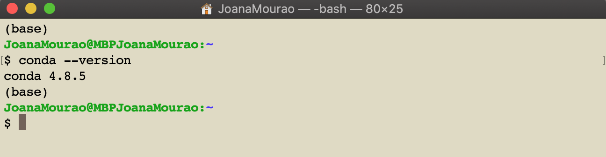
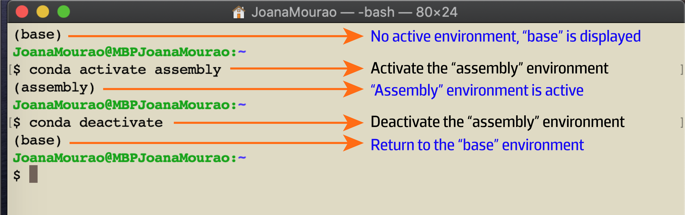

.. _ngs-tools:

******************
Tools installation
******************

* Before you start this Tutorial, you need to have installed |conda| in your UNIX-based or Windows operating system.

* |conda| is an open-source package management system and environment management system that runs on Windows, macOS, and Linux, that can:

  * Quickly install, runs and update packages and their dependencies.

  * Easily create, save, load, and switch between environments on your local computer.

* |conda| was created for Python programs, but it can package and distribute software for any language.

To check if you already have |conda| installed open the Terminal and type:

.. code-block:: bash

   $ conda --version

*Figure 3. macOS Terminal showing the current version of conda.*

If you see the version number on the Terminal screen, you can skip the section "How to install conda". However, I suggest you update conda for the last version.
To do this you can run on the Terminal window:

.. code-block:: bash

   $ conda update conda

How to install conda
####################

Conda is included in all versions of |anaconda| and |miniconda|. For this Tutorial, you will install |miniconda|.
Miniconda is a small version of Anaconda that only includes conda, its dependencies, Python and requires only ~400 MB disk space. You will use conda to install almost all the tools for this Tutorial easily.

.. attention::
   Contrarily to Miniconda, if you are interested in the hundreds of packages included with the Anaconda Individual Edition remember that this will require a lot of disk space in your computer (minimum 5 GB to download and install).

The example provided below is for a standard installation on a Linux-based system with Python 3.9. For `Windows <https://conda.io/projects/conda/en/latest/user-guide/install/windows.html>`_ and `macOS <https://conda.io/projects/conda/en/latest/user-guide/install/macos.html>`_ follow the instructions provided in |miniconda| official page.

1. Download the latest miniconda installer by typing in the Terminal window:

.. code-block:: bash

   $ wget https://repo.anaconda.com/miniconda/Miniconda3-py38_4.12.0-Linux-x86_64.sh

.. note::
   In alternative to Terminal, you can download the miniconda installer directly by clicking on **Miniconda3 Linux 64-bit** `here <https://docs.conda.io/en/latest/miniconda.html#linux-installers>`_.

2. To install conda, type in your Terminal window:

.. code-block:: bash

   $ bash Miniconda3-latest-Linux-x86_64.sh

3. Follow the prompts that will appear on the installer screen and accept all the default settings.

.. attention::
   At the end of the installation when the installer prompts “Do you wish the installer to initialize Miniconda3 by running ``conda init``?” It is recommended to say “YES” to run conda correctly and smoothly.

4. Close and re-open your Terminal window to make the changes take effect.

5. To verify your installation type on Terminal window ``conda list``. If you see a list of installed packages, you are ready to go.

6. At the end of this Tutorial if you no longer want to have installed |miniconda| you can simply remove it by typing:

.. code-block:: bash

   # Remove Miniconda installer directory
   $ rm -rf ~/miniconda

   # Remove additional hidden files and folders that you created
   $ rm -rf ~/.condarc ~/.conda ~/.continuum

How to create environments
##########################

A `conda environment <https://docs.conda.io/projects/conda/en/latest/user-guide/concepts/environments.html>`_ is a directory that can contain several installed conda packages for a specific project.
For example, you can have several conda environments, each one with different packages that required different Python versions.
You can quickly **activate** or **deactivate** environments, and because of that, they will work independently, thus minimizing the risk of incompatibilities between installed packages.

In this Tutorial, you will create a conda environment and install all the required packages to assemble and analyze bacterial genomes. All these steps will be performed in the Terminal window.

1. To create an environment with ``conda`` for Python development you can run:

.. code-block:: bash

   # This will create an environment with the same Python version as your current Shell Python interpreter
   $ conda create -n ENVNAME python

.. note::
   Replace **ENVNAME** by the name of your environment (e.g., omics).

.. code-block:: bash

   # This will create an environment with a different Python version (e.g., 3.9)
   $ conda create -n ENVNAME python=3.9

2. You can also install at the same time all the packages that you want to include in the environment.

.. code-block:: bash

   # This will create an environment with Python and NumPy
   $ conda create -n ENVNAME python=3.9 numpy=1.9.3

.. attention::
   It is recommended that you install all the packages at the same time to help avoid dependency conflicts.

3. To **activate** a specific environment run:

.. code-block:: bash

   $ conda activate ENVNAME

4. To **deactivate** a specific environment run:

.. code-block:: bash

   $ conda deactivate

*Figure 4. macOS Terminal showing an activated environment named "assembly".*

How to install packages
#######################

1. Setting up conda channels

After creating your environment and before installing any packages, first you need to set up the conda channels.
A `channel <https://docs.conda.io/projects/conda/en/latest/user-guide/concepts/channels.html>`_ is a location where the packages tools are stored and can be easily accessed.

In this Tutorial you will use three conda channels that should be added in this order by running:

.. code-block:: bash

    $ conda config --add channels defaults
    $ conda config --add channels bioconda
    $ conda config --add channels conda-forge

2. Install conda packages and tools

* To install new packages in your environment first activate your environment ``conda activate ENVNAME`` and second run:

.. code-block:: bash

    # Installing a new package
    # Replace PKGNAME by the name of your package
    $ conda install PKGNAME

    # For example, this will install two packages called abricate and bwa
    $ conda install abricate bwa

* You can also install packages without activating your environment although in this case, you need to specify the environment name in the command line as:

.. code-block:: bash

    # Create an environment and install a package at the same time
    $ conda install -n ENVNAME PKGNAME

    # In this case, it will install in the environment "assembly" the package "abricate"
    $ conda install -n assembly abricate

.. seealso::
   You can find in this `link <https://anaconda.org/bioconda/repo?access=all>`_ a full list of all available bioconda packages.
   All tools will be installed as you need them in the different sections of the tutorial.

Here is a list of all packages that you will install throughout the Tutorial.

.. csv-table::
   Table with a full list of packages and tools needed for this Tutorial.
   :header: "Package name", "Version", "Tutorial section", "Environment", "Conda command"
   :widths: 20, 10, 20, 10, 20

   "sra-tools", "2.8.0", "Data acquisition", "data", "``conda install -c bioconda sra-tools``"
   "ncbi-genome-download", "0.3.0", "Data acquisition", "data", "``conda install -c bioconda ncbi-genome-download``"
   "ncbi-acc-download", "0.2.6", "Data acquisition", "data", "``conda install -c bioconda ncbi-acc-download``"
   "fastqc", "0.11.9", "Quality control", "qc", "``conda install -c bioconda fastqc``"
   "multiqc", "1.9", "Quality control", "multiqc", "``pip install multiqc``"
   "bbtools", "37.62", "Quality control", "home directory", "Install in your home directory"
   "kraken2", "2.1.0", "Taxonomy", "qc", "This package will be installed with Bracken"
   "bracken", "2.6.0", "Taxonomy", "qc", "``conda install -c bioconda bracken=2.6.0``"
   "krona", "2.7.1", "Taxonomy", "qc", "``conda install -c bioconda krona``"
   "spades", "3.14.1", "De novo genome assembly", "assembly", "This package will be installed with Unicycler"
   "unicycler", "0.4.8", "De novo genome assembly", "assembly", "``conda install -c bioconda unicycler``"
   "bandage", "0.8.1", "De novo genome assembly", "qc", "``conda install qt=5.12.9 bandage``"
   "quast", "5.0.2", "De novo genome assembly", "qc", "``conda install -c bioconda quast``"
   "prokka", "1.14.6", "Genome annotation", "annotation", "``conda install -c conda-forge -c bioconda -c defaults prokka``"
   "abricate", "1.0.1", "Genome annotation", "annotation", "``conda install -c conda-forge -c bioconda -c defaults abricate``"
   "busco", "4.1.2", "Genome annotation", "busco", "``conda install -c bioconda busco``"

Conda cheat sheet
#################

.. code-block:: bash

    # See a list of all created environments
    $ conda info -e

    # Print a list of all installed packages and version in the current environment
    $ conda list

    # Delete an entire environment
    $ conda remove --name ENVNAME --all

    # Remove unused cached files including unused packages
    $ conda clean --yes --all

    # Update all packages
    $ conda update --all --yes --name ENVNAME # Without activating the environment
    $ conda update --all --yes # With environment activated

    # Update a specific package
    $ conda update -n ENVNAME PKGNAME # Without activating the environment
    $ conda update PKGNAME # With environment activated

    # Remove a specific package
    $ conda uninstall -n ENVNAME PKGNAME # Without activating the environment
    $ conda uninstall PKGNAME # With environment activated
