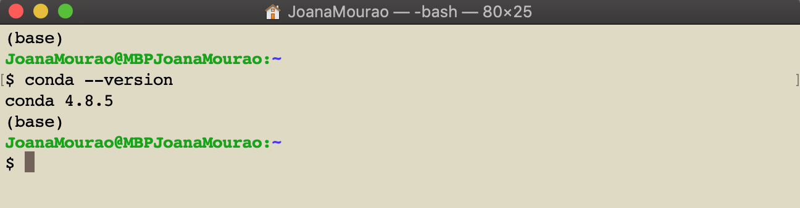
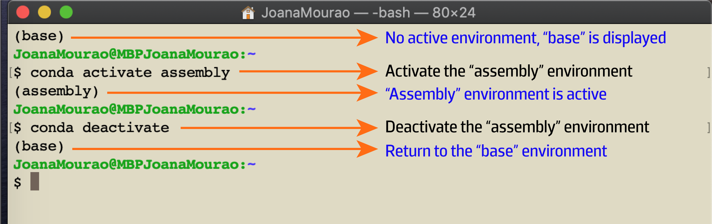

.. _ngs-tools:

******************
Tools installation
******************

* Before you start this Tutorial, you need to have installed |miniforge| (which includes |mamba| and |conda|) in your UNIX-based system.

* |mamba| is a fast, open-source package manager and environment manager that runs on Windows, macOS, and Linux, that can:

  * Quickly install, run and update packages and their dependencies.

  * Easily create, save, load, and switch between environments on your local computer.

* |mamba| is a reimplementation of |conda| written in C++. It uses the same commands, packages, and channels as |conda|, but it is much **faster** at solving the dependencies and downloading the packages, which is very useful when installing bioinformatics tools. It was created for Python programs, but it can package and distribute software for any language.

To check if you already have |mamba| installed open the Terminal and type:

.. code-block:: bash

   $ mamba --version

*Figure 3. macOS Terminal showing the current version of conda. The same is done for mamba with the command* ``mamba --version``.

If you see the version number on the Terminal screen, you can skip the section "How to install Miniforge (mamba)". However, I suggest you update it to the last version.
To do this you can run on the Terminal window:

.. code-block:: bash

   $ mamba update --name base mamba conda

How to install Miniforge (mamba)
################################

|mamba| is included in |miniforge|, a minimal installer that also includes |conda|, Python, and uses the **conda-forge** channel by default. For this Tutorial, you will install |miniforge| (**Miniforge3**). You will use ``mamba`` to install almost all the tools for this Tutorial easily.

.. attention::
   Do not install |anaconda| or |miniconda| for this Tutorial. Anaconda includes hundreds of packages that require a lot of disk space in your computer (minimum 5 GB), and the ``defaults`` channel of Anaconda has `terms of service <https://www.anaconda.com/legal/terms/terms-of-service>`_ that may restrict its use in some institutions. This is why in this Tutorial the ``defaults`` channel is **not** used.

The example provided below is for a standard installation on a Linux-based system or macOS (both Intel and Apple Silicon). For Windows, install first the WSL (see :ref:`Before we begin <before-begin>`) and follow the Linux instructions. More details can be found in the |miniforge| official page.

1. Download the latest Miniforge3 installer by typing in the Terminal window:

.. code-block:: bash

   $ curl -L -O "https://github.com/conda-forge/miniforge/releases/latest/download/Miniforge3-$(uname)-$(uname -m).sh"

.. note::
   In alternative to Terminal, you can download the installer directly from the Miniforge `releases page <https://github.com/conda-forge/miniforge/releases/latest>`_.

2. To install Miniforge3 (with mamba), type in your Terminal window:

.. code-block:: bash

   $ bash Miniforge3-$(uname)-$(uname -m).sh

3. Follow the prompts that will appear on the installer screen and accept all the default settings.

.. attention::
   At the end of the installation when the installer prompts "Do you wish to update your shell profile to automatically initialize conda?" it is recommended to say "YES" to run mamba and conda correctly and smoothly.

4. Close and re-open your Terminal window to make the changes take effect. You should see ``(base)`` at the beginning of the prompt.

5. To verify your installation type on Terminal window ``mamba --version`` and ``mamba list``. If you see the version number and a list of installed packages, you are ready to go.

6. At the end of this Tutorial if you no longer want to have installed |miniforge| you can simply remove it by typing:

.. code-block:: bash

   # Remove Miniforge installation directory
   $ rm -rf ~/miniforge3

   # Remove additional hidden files and folders that you created
   $ rm -rf ~/.condarc ~/.conda

.. note::
   If you installed |miniconda| or |anaconda| instead, the installation directory is ``~/miniconda3`` or ``~/anaconda3``, respectively. In that case, install |miniforge| in a different directory and use the ``mamba`` command of Miniforge, or uninstall the previous version before continuing.

.. hint::
   **mamba or conda?** In this Tutorial, all the commands that install, update or remove packages and environments use ``mamba``, since it is faster. Both programs share the same environments and packages, so you can use ``conda`` instead of ``mamba`` in any of these commands (e.g., ``mamba install fastqc``). The only exception is the **activation** of the environments, that in this Tutorial is always performed with ``conda activate`` and ``conda deactivate``, since it works immediately after the installation of Miniforge. (``mamba activate`` only works after running ``mamba shell init`` and re-opening the Terminal.)

How to create environments
##########################

A `conda environment <https://docs.conda.io/projects/conda/en/stable/user-guide/concepts/environments.html>`_ (created with mamba or conda) is a directory that can contain several installed packages for a specific project.
For example, you can have several environments, each one with different packages that required different Python versions.
You can quickly **activate** or **deactivate** environments, and because of that, they will work independently, thus minimizing the risk of incompatibilities between installed packages.

In this Tutorial, you will create several environments and install all the required packages to analyze and assemble bacterial genomes. All these steps will be performed in the Terminal window.

1. To create an environment with ``mamba`` for Python development you can run:

.. code-block:: bash

   # This will create an environment with the same Python version as your current Shell Python interpreter
   $ mamba create -n ENVNAME python

.. note::
   Replace **ENVNAME** by the name of your environment (e.g., omics).

.. code-block:: bash

   # This will create an environment with a different Python version (e.g., 3.11)
   $ mamba create -n ENVNAME python=3.11

2. You can also install at the same time all the packages that you want to include in the environment.

.. code-block:: bash

   # This will create an environment with Python and NumPy
   $ mamba create -n ENVNAME python=3.11 numpy

.. attention::
   It is recommended that you install all the packages at the same time to help avoid dependency conflicts.

3. To **activate** a specific environment run (the ``(base)`` at the beginning of the prompt changes to the name of the environment):

.. code-block:: bash

   $ conda activate ENVNAME

4. To **deactivate** a specific environment run:

.. code-block:: bash

   $ conda deactivate

*Figure 4. macOS Terminal showing an activated environment named "assembly".*

How to install packages
#######################

1. Setting up channels

Before installing any packages, first you need to set up the channels.
A `channel <https://docs.conda.io/projects/conda/en/stable/user-guide/concepts/channels.html>`_ is a location where the packages tools are stored and can be easily accessed.

In this Tutorial you will use two channels, **conda-forge** and **bioconda**. The channels at the top of the list have the highest priority; therefore, add them in the following order (only once):

.. code-block:: bash

    $ mamba config prepend channels conda-forge
    $ mamba config append channels bioconda
    $ mamba config set channel_priority strict

    # Check the result: conda-forge must be the first one and defaults should not be present
    $ mamba config get channels

.. attention::
   Do not use the ``defaults`` channel. With the previous version of this Tutorial (``conda config --add channels``), the channel added **last** had the highest priority; with ``mamba config prepend/append``, the order is the one that is written.

.. warning::
   Some bioconda packages are not yet available for **macOS with Apple Silicon (M1/M2/M3...)**. If a package is not found, create the environment using the Intel architecture, which runs through Rosetta 2:
   ``CONDA_SUBDIR=osx-64 mamba create -n ENVNAME``, and then ``conda activate ENVNAME`` followed by ``conda config --env --set subdir osx-64``.

2. Install packages and tools

* To install new packages in your environment first activate your environment ``conda activate ENVNAME`` and second run:

.. code-block:: bash

    # Installing a new package
    # Replace PKGNAME by the name of your package
    $ mamba install PKGNAME

    # For example, this will install two packages called abricate and bwa
    $ mamba install abricate bwa

* You can also install packages without activating your environment although in this case, you need to specify the environment name in the command line as:

.. code-block:: bash

    # Install a package in an existing environment without activating it
    $ mamba install -n ENVNAME PKGNAME

    # Create an environment and install a package at the same time
    $ mamba create -n ENVNAME PKGNAME

    # In this case, it will install in the environment "annotation" the package "abricate"
    $ mamba install -n annotation abricate

.. seealso::
   You can find in this `link <https://anaconda.org/bioconda/repo?access=all>`_ a full list of all available bioconda packages.
   All tools will be installed as you need them in the different sections of the tutorial.

Here is a list of all packages that you will install throughout the Tutorial. The versions shown are the latest ones at the time of writing; newer versions may be available when you run it (use ``mamba search PKGNAME`` to check).

.. csv-table::
   Table with a full list of packages and tools needed for this Tutorial.
   :header: "Package name", "Version", "Tutorial section", "Environment", "Install command"
   :widths: 20, 10, 20, 10, 20

   "sra-tools", "3.4.1", "Data acquisition", "data", "``mamba install sra-tools``"
   "ncbi-genome-download", "0.3.3", "Data acquisition", "data", "``mamba install ncbi-genome-download``"
   "ncbi-acc-download", "0.2.8", "Data acquisition", "data", "``mamba install ncbi-acc-download``"
   "fastqc", "0.13.0", "Quality control", "qc", "``mamba install fastqc``"
   "multiqc", "1.35", "Quality control", "multiqc", "``mamba install multiqc``"
   "bbmap (BBTools)", "40.02", "Quality control", "qc", "``mamba install bbmap``"
   "kraken2", "2.17.2", "Taxonomy", "taxonomy", "``mamba install kraken2 bracken``"
   "bracken", "3.1", "Taxonomy", "taxonomy", "This package is installed together with Kraken2"
   "krona", "2.8.1", "Taxonomy", "taxonomy", "``mamba install krona``"
   "unicycler", "0.5.1", "De novo genome assembly", "assembly", "``mamba install unicycler``"
   "spades", "4.3.0", "De novo genome assembly", "assembly", "This package will be installed with Unicycler"
   "bandage", "0.9.0", "De novo genome assembly", "home directory", "https://rrwick.github.io/Bandage/"
   "quast", "5.3.0", "De novo genome assembly", "qc", "``mamba install quast``"
   "bakta", "1.12.1", "Genome annotation", "bakta", "``mamba install bakta``"
   "abricate", "1.4.0", "Genome annotation", "abricate", "``mamba install abricate``"
   "busco", "6.1.0", "Genome annotation", "busco", "``mamba install busco``"
   "resfinder", "4.7.2", "Antimicrobial resistance", "amr", "``mamba install resfinder ncbi-amrfinderplus``"
   "ncbi-amrfinderplus", "4.2.7", "Antimicrobial resistance", "amr", "This package is installed together with ResFinder"
   "kma", "1.6.17", "Antimicrobial resistance and plasmids", "amr, plasmidfinder", "This package is installed together with ResFinder and PlasmidFinder"
   "plasmidfinder", "2.1.6", "Plasmids", "plasmidfinder", "``mamba install plasmidfinder``"
   "mob_suite", "3.1.9", "Plasmids", "mobsuite", "``mamba install mob_suite``"

Conda cheat sheet
#################

.. code-block:: bash

    # See a list of all created environments
    $ mamba env list

    # Print a list of all installed packages and version in the current environment
    $ mamba list

    # Delete an entire environment
    $ mamba env remove --name ENVNAME

    # Remove unused cached files including unused packages
    $ mamba clean --yes --all

    # Update all packages
    $ mamba update --all --yes --name ENVNAME # Without activating the environment
    $ mamba update --all --yes # With environment activated

    # Save the exact list of installed packages and versions to a file (reproducibility)
    $ mamba list --name ENVNAME --export > ENVNAME_packages.txt

    # Export the environment to a YAML file and re-create it in another computer
    $ mamba env export --name ENVNAME --from-history > ENVNAME.yml
    $ mamba env create --file ENVNAME.yml

    # Update a specific package
    $ mamba update -n ENVNAME PKGNAME # Without activating the environment
    $ mamba update PKGNAME # With environment activated

    # Remove a specific package
    $ mamba remove -n ENVNAME PKGNAME # Without activating the environment
    $ mamba remove PKGNAME # With environment activated
