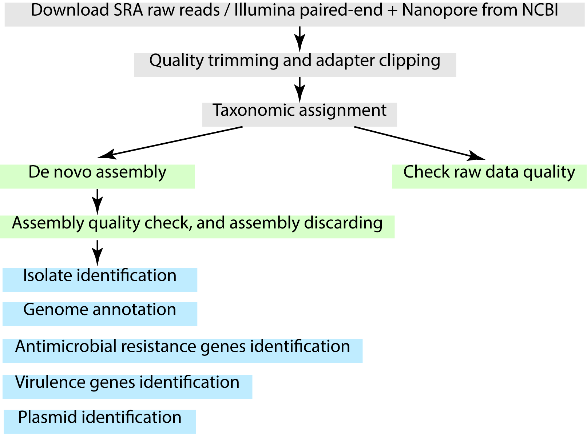

.. _objectives:

**********
Objectives
**********

In this Tutorial, you will learn how to acquire, process, and analyse raw next-generation sequencing (NGS) data from bacterial isolates (whole-genome sequencing).

.. attention::
   * This is not a mandatory, exhaustive, or official pipeline. The appropriated pipeline will depend on the **type of data** that you have and the main **objectives**.
   * The pipeline that is provided is just an **example** of one of the approaches.
   * Since **new tools and packages** are continually being developed, you may need to **update your pipeline** to include the best ones that fit your purpose.

What you'll learn
#################

The following topics will be covered:

  - Acquisition of NGS raw reads
  - Raw reads evaluation and cleaning
  - Species identification
  - De novo assembly and quality control
  - Genome annotation
  - Detection of antimicrobial resistance genes and mutations (resistome)
  - Detection of plasmids and plasmid reconstruction
  - Running the same analysis in several genomes using Bash loops

What you'll build
#################

  - A complete or draft microbial genome
  - A report of specific genotypic features (antimicrobial resistance genes and mutations, plasmids, and virulence genes)
  - A table that combines the results of several genomes

Pipeline
########

*Figure 1. The pipeline used in this tutorial to acquire, process, and analyze microbial genomic data. The detection of antimicrobial resistance genes/mutations (ResFinder/PointFinder, AMRFinderPlus) and the plasmid detection and reconstruction (PlasmidFinder, MOB-suite, plasmidSPAdes) are performed on the genome assemblies, together with the genome annotation.*
